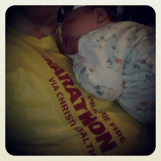
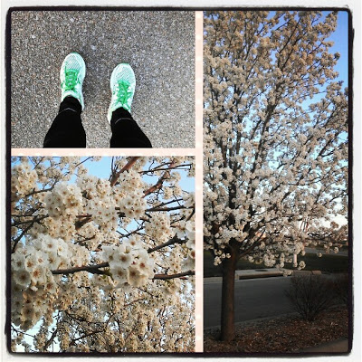
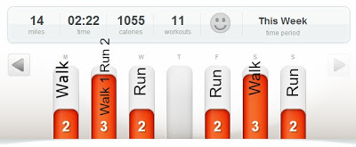

Yesterday, I ran for Boston. Two silent miles in the rain. It felt like I was running through tears. 

  

I'm heartbroken and I really have no words. I will continue to pray for those affected by the bombing at the Boston Marathon. I will continue to do what I can to be good to others. I will continue to run. 

  

<table align="center" cellpadding="0" cellspacing="0"><tbody><tr><td></td></tr><tr><td>I wore my marathon race shirt for Boston on Monday.</td></tr></tbody></table>

  
  

\-----------------------------------

  

  

I had written this post over the weekend to go out on Tuesday morning. It was too soon, so I held it back. Today, it's still too soon but I'm posting it to log my workouts for last week.

  

  

\------------------------------------

  
  
Last week I always had to check the weather before heading out for a run. We went through a variety of weather conditions here in Kansas including extreme wind, an ice storm and just being plain cold, especially for spring. Both the wind and the ice storm had me running downstairs on the treadmill but I opted to go outside for the early morning freezing run. 

  

<table align="center" cellpadding="0" cellspacing="0"><tbody><tr><td></td></tr><tr><td>Photo via <a href="http://instagram.com/amotherspace" target="_blank">Instagram</a></td></tr></tbody></table>

I just put on my tights and layered up before heading out. It was cold but not miserable and it was nice to be out in the fresh air. Even though the temps were in the 20's I took the time to soak in a few signs of spring. Brrr....

  

Right now I'm staying put at running 2 miles at a time. I'm 7 weeks postpartum and really want to run 2 miles easier (or more quickly) before I up the mileage. It's a run I can do with a warm up and cool down in about 30 minutes which makes it easy to find the time to run before my husband goes to work. With a 7 week old baby and my two other children time is limited so I'm starting out with shorter workouts. It's working well so far!

  

My Workouts from Last Week

  

  

  

Monday:

Strength Training: 10 minutes

1.5 mile Walk

  

Tuesday:

2 mile Run   
1 mile Walk

10 minutes Stretching

  

Wednesday:

2 mile Run

15 minutes Stretching

  

Thursday:

Rest

  

Friday:

2 mile Run

  

Saturday:  
3 mile Walk

  

Sunday:

2 mile Run  
  
Totals:  
Running: 8 miles  
Walking: 5.5 miles
