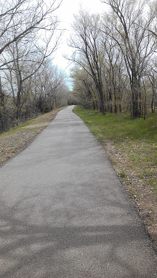

Friday night I felt like a bad mother. We were out to eat and I always try to put my phone away during dinner. But Friday night I couldn't stop looking at Twitter. As we were driving to the restaurant the tweets starting coming out that they were closing in on the Boston Marathon bombing suspect. I had been following it closely all day and was eager to hear the updates. So my husband and I watched it all unfold on Twitter during dinner. I would look up at the other people in the restaurant and be amazed that no one else seemed to realize that this was going on. Did they not care? Did they just not know that it was happening?   
  
I'm so glad that they caught him. I'm also anxious to hear more about why. I hope we find out why. Later on, after we were home we turned on the t.v. to watch the press conference and all of the celebrating. I'm so happy for the Boston area communities. I'm thankful to the officers that worked around the clock and endangered their lives to keep Boston and our country safe.   
  
On Saturday I ran for Boston again. I'm pretty sure that all the victims of the bombing will be in my thoughts during every run for quite some time.   
  

\-----------------------------------

  
Last week I said in [**my post**](http://amotherspace.blogspot.com/2013/04/two-miles-at-time.html#.UXLvOrVQGHg) that I wanted to stay at 2 miles until I was able to run a little more quickly. Just a couple days later I realized that the first 5K that I would like to run is only 3 weeks away. Yikes! It just doesn't seem like May is coming next week already because it's still been so cold. It doesn't seem like spring yet, or typical Kansas April weather. Snow is in the forecast for this week, crazy!  
  
Needless to say I decided that I needed to up my mileage a little bit before I signed up for the upcoming Girls on the Run 5K. I needed to know that I could run that distance comfortably before signing up.   
  
So on Saturday I set out for my 'long run' and ran 3 miles. Bahaha! I went to the park to run and it felt wonderful. I don't think I've gone for a run there since before I was pregnant and it's one of my favorite places to get in some miles.   
  

  
The leaves on the trees were starting to grow and things were greening up just a little bit all over. It was a windy run and not a quick one (3 miles in 35:51) but I proved to myself that I am able to run the 5K in a few weeks. I'm not running it to PR but it's an organization that I like to support and I don't want to miss out on it.
