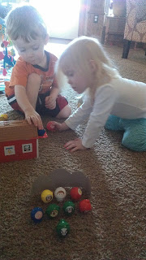
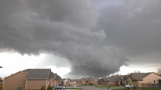

1\. Apparently, I'm not very good at Uno Moo. My son kept sending skunks my way and I ended up with way too many animals in my haystack. It's one of our favorites!

  

  

2\. Until owning one, I never enjoyed running on a treadmill. Now I am surprised to find out that I run more quickly on it. Although I enjoy running outside I am struggling with it right now. It's so difficult to pick up the pace on the road. I've heard that treadmills are 'easier' because the belt is propelling you along but they were always harder for me mentally. Maybe I'm doing a better job of distracting myself because I just turn on a t.v. show or listen to a podcast and run. The time flies by!

  

  

I'm not close to my pre-pregnancy pace but I am getting a little faster postpartum. 

  

3\. This crazy looking cloud passed by our house. We sat out on our porch and watched the sky for awhile. There was no threat of a tornado but it did bring a lot of rain with it. 

  

  

4\. My book club met this week. I was glad that Little E was up for snuggles because I was no where near finished with my book. Somehow I made it through the book (I read it in 2 and a half days!) and loved it. We read "The Storyteller" by Jodi Picoult. The subject matter was difficult to read (WWII) but the characters pulled you in. It was tough to put down. I highly recommend it.

  

  

5\. Our little sweetie is 2 months old! 

  

  

Happy Friday!
