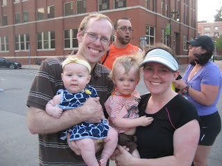

It seems as though everyone is running and racing lately. I see runners out on the streets all the time. I see running posts all over facebook. So many of my friends have recently taken it up (even my husband who was a self professed NONrunner). Some ran a little off and on and then within the past several months have started signing up for races. Some have never ran in their lives but have now decided they want to run a 5K.   
  
  

<table align="center" cellpadding="0" cellspacing="0"><tbody><tr><td></td></tr><tr><td>Taken at one of my first official races.</td></tr></tbody></table>

  
All this means that I get to talk 'running' with more of the people in my life. Bonus! It also makes race day more exciting when I see friends at the start and finish.   
  
  

  
It's wonderful that so many people are taking it up. I only imagine that more and more people will begin running after witnessing how the running community has come together after the Boston Marathon this year.   
  
So why the increase? Why are so many more people lacing up their shoes?  
  
  

- Because all the cool people are doing it. 

I say this half kidding (I've definitely never been in the 'cool' crowd!) but in a way it is true. Talking to friends about running makes them want to run too. It's commonly thought that running is a lonely sport but actually it can be far from that. Training for races and running races together is an excellent way to spend quality time with friends.  
  
  

- Raising money for a favorite charity.

Helping a charity was the main reason I signed up for my first race. I had been a runner since middle school but never raced. I decided to raise money by running a Nike Half Marathon for the Leukemia and Lymphoma Society (LLS).   

  
A couple of years after that I ended up running my first marathon with Team in Training to again raise money for LLS. I usually pick a local 5K that benefits a good cause. That's why I am running the Girls on the Run 5K and Get Your Rear in Gear 5K this May.  
  
  

- Signing up for races motivates people to exercise.

Some people might start running to lose a little weight or just get in better shape. But when you set a goal to run a 5K (or any other distance) and you put down the money for the bib it motivates most people to train (run) and finish the race. The Couch to 5K training apps are used by many as a training plan for those new to running. I know that signing up for a race helps me to get out of bed on those early mornings to run.   
  
These are just a few of the reasons that we see more runners signing up for races and hitting the pavement in between. I know there are many more so I want to hear from you too.  
  

**Why do you think that running has become so popular in recent years?**

  
  

  

**Do you sign up for races or do you run on your own?**

  

  

\------------------------------------------

  

  
Find A Mother's Pace on...  
  
Twitter [@amotherpace3](https://twitter.com/amotherspace3)  
  
Facebook [http://facebook.com/amotherspace3](http://facebook.com/amotherspace3)   
  
Instagram [amotherspace](http://instagram.com/amotherspace)  
  
RSS [amotherspace](http://feeds.feedburner.com/amotherspace)
