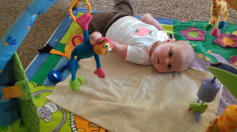
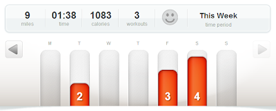

Is it possible to injure ribs just by laying on them? Um, I think so. I was having a ball on the floor with my daughter. She was laying in this  

  
and batting at her toys. So much fun! There were smiles all around. Then I tried to get up. I could hardly move because my ribs hurt so badly. It hurt to twist. It hurt to bend down. Sometimes it hurt to breathe or cough. I could barely hold my daughter! I was pretty upset because just when I was starting to feel comfortable with running again I get hurt.   
  
I'm guessing that it's due to my postpartum ligaments. I stretched out my ribs too much while I was on my stomach. ???  
  
I skipped running the next day (Wednesday) and took an unexpected rest day. Thursday is our busy day and I usually don't plan to run on that day anyway. Two days of rest was all I needed (Yay!) and I was back at it on Friday.   
  
I was imagining a long drawn out healing process when it first happened so I'm glad it worked out this way.  
  
Here's what I did last week.  
  
  

  
I ran fewer days but I ended up having the same mileage from last week because two of my runs were longer this week.   
  
Friday's run was on the treadmill. I stepped outside to run just when a big streak of lightning flashed across the sky. I'm so happy that we have the option to run in our basement when it doesn't work to run outside. I ran a 10:13 pace during the 3 miles. It's my fastest postpartum run yet. I'm slowly getting faster.   
  
  
**Have you ever had a strange postpartum injury?**  
**What kind of weather keeps you running inside?**
