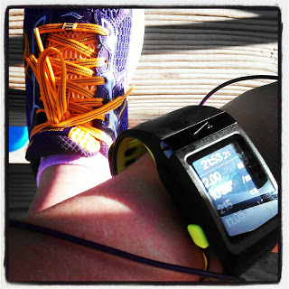

My last run of the month was a nice and cool early morning loop around the neighborhood.   
  
  

<table align="center" cellpadding="0" cellspacing="0"><tbody><tr><td></td></tr><tr><td>Follow me on <a href="http://instagram.com/amotherspace" target="_blank">Instagram</a></td></tr></tbody></table>

It was also my first time out in my new Saucony Ride 5's. I absolutely loved them. The toe of this shoe felt a little wider and more comfortable than my other shoe in rotation right now. I'll break these in a little and then they will be my go-to shoe for my long runs.  
  
My first month of postpartum running proved to be a little harder than I expected.   
  
The running itself was pretty tough. It's a lot harder than I remember to run 2 or 3 miles. It seems crazy to even say write that because I was used to running so much longer than that before the pregnancy. My pace is still slower than before but it is getting better. My goal for my run yesterday was for the average pace to come in under 11 minutes per mile. I just barely did it, but I did it! I've found this month that it's easier to run more quickly on the treadmill. I can set the pace and then I have to stick with it or fly off the mill. Outside it is much harder but I'm running about a minute faster per mile than I was at the beginning of the month.   
  
It's also difficult to find the time to run postpartum. I wrote about it [**earlier in the month**](http://amotherspace.blogspot.com/2013/04/squeezing-in-exercise-with-3-small.html#.UYAi7rVQGHg) and so far this month my husband and I are making it work. I usually run before my husband goes to work and then either early on the weekend or during nap time. I have to take into consideration the needs of my children before I can head out for a run. Postpartum, this really means making sure my youngest daughter is nursed before I run or that I will be back before she is awake and hungry.   
  
Most of my runs this month have been 2 miles at a time. I recently added a 3 mile run during the week and I ran 4 miles last Saturday. I would like my daily weekday mileage to be around 3 miles and I'm working towards running a long run between 5 and 8 miles every weekend. I'm hoping to reach this base before training starts for my half marathon in the fall.   
  
Running has made some of my pregnancy weight disappear. I still have 19 lbs. to go until I'm back at my before pregnancy weight. Considering I gained 40 lbs. and I'm only 2 months postpartum, I don't think that's too bad!  
  
Overall, I'm so glad I'm running again. It feels good to be back!  
  
Here are the numbers for April:  
  
Total Running Miles: 33  
Treadmill Running Miles: 14  
Total Walking Miles: 13  
  
Total Running Miles for 2013: 34
