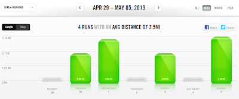

My running is going well. I feel like I'm getting back into it at a pretty good rate after my pregnancy.   
  
  

  
  

[Instagram](http://instagram.com/amotherspace) pic taken after a run with friends this weekend.

  
It's the other stuff (The strength training and the core work that is so desperately needed!) that I'm failing to add to my day.   
  
With the new month I decided to add a couple of challenges to my fitness routine to keep the motivation going. I've seen them all over the place but I've never participated in one until now. Of course, right after I decide to do this I read [Tamara's post](http://bit.ly/10exNC5) on challenges and now I'm reevaluating. It really doesn't make sense to do the crazy high repetition squats or the crazy long planks.   
  
The squat challenge started off with 50 squats which were surprisingly easy. By the time I had decided to quit the challenge I was up to 70. They really weren't hard at all, although I could feel the difference in my legs. Now I'm going to just keep the squats in my regular strength training routine with normal amount of reps (10-12).   
  
I've also decided to do a plank a day. I started with a measly 33 second plank on May 1st and already I'm up to 51 seconds. My poor postpartum core is not happy with me for choosing this challenge! I'm not totally giving up this challenge because I don't know that I would ever be able to hold _or want to hold_ a plank for more than two minutes. So I'll continue to do a plank a few days in a row and then give myself a break.   
  
I need to make it my 'challenge' to fit a little strength training in every day. Different moves every day so that I am working various muscle groups and staying healthy.  
  
  
Here's a look at my running week from Nike+:  
  
  

  

  
My mileage went up just a little. 10.16 miles! I'm happy to say that 3 mile runs are starting to feel more comfortable. I'm also excited to see some race day miles in my running log. If you missed it, here's what I had to say about the [Wichita Prairie Fire 5K](http://bit.ly/YqdJ3p) that I ran on Sunday.  
  
Seeing the half marathoners at the Prairie Fire on Sunday made me antsy to start running long again. I can't wait to start my half marathon training and slowly see the weekend mileage go up! Training starts in June so I need to figure out my training plan sooner rather than later.   
  
  
  
  
  
Have you participated in a fitness challenge?  
  
How long can you hold a plank?
