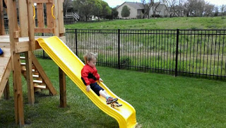
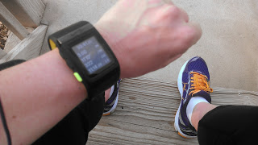
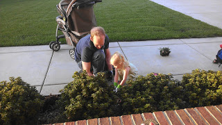
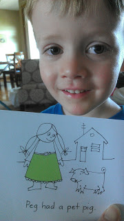

Happy Friday! Yes, I'm a stay-at-home mom but I still love my weekends and boy am I glad it's Friday.   
  
It's been a pretty good week around here. We've done some tummy time.  
  
  

  
We've had a lot of playground fun.  
  
  

  
  
I've gotten in some great running. (Great just because it's happening and it makes me happy!)  
  

  
It's been spring-like outside (finally, here in Kansas!) _and_ we've managed to get some plants in the ground.  
  
  

  
Little O read his first sentence all by himself. I'm a proud mommy!  
  
  

  
Oh, and there are plenty of smiles. Really, I just can't get enough of her little smiles.   
  
  

  
  
I'm sharing the love this week. Here are 5 of my favorite posts that I read throughout the week.  
  
1\. These Raspberry Lemonade Crumb Muffins from Iowa Girl Eats look amazingly mouth watering. [Here](http://bit.ly/18sd4Cu) is the recipe. I must make these soon!  
  
2\. I have a foam roller and "The Stick." I found this post by Tina Reale on foam rolling to be very informational. I love the 'how to' image that she included. [Roll with Me](http://bit.ly/10Hknyx).  
  
3\. This [post](http://bit.ly/10HkOZJ) from Food Babe is a must read before buying sunscreen. It's so frustrating to me that we have to worry about the ingredients causing us more harm than good.   
  
4\. Do you spring clean? This week the Keeper of the Home blogger admitted to NOT spring cleaning and gave a couple tips on how she keeps her house clean. Find it [here](http://bit.ly/18s9Tur). I'm always looking for ways to make this easier so I printed off the calendar and the list that she uses. I'm planning on tweaking it to make it work for my family.   
  
5\. And finally, Miss Zippy wrote a little post about something she learned from her daughter recently. Check it out [here](http://bit.ly/18s9uYU).   
  
  
That's all for today. Have a great weekend!
