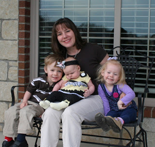
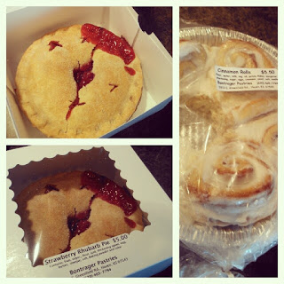
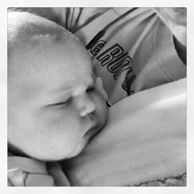
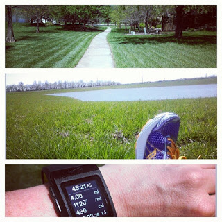
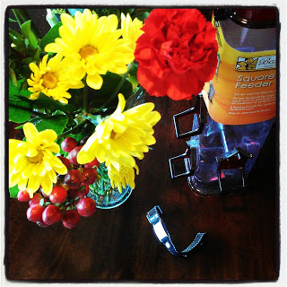
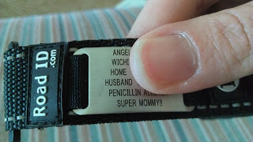

Mother's Day is always a special day but it was even better this year because of our new addition.   
  
  

  
We had a fabulous Mother's Day weekend. Here's a little peak.  
  
We started off Saturday at the Farmer's Market. We bought kale, asparagus, and bread but my Mother's Day splurges were cinnamon rolls for Sunday breakfast and strawberry rhubarb pie for dessert on Sunday. They did not disappoint!  
  
  

  
I also got in some quality snuggling with my youngest on Saturday. I think she might be teething. It's harder to put her down to sleep during the day and she wants to be held more while she is awake. I'm not complaining...I love the snuggles!  
  
  

  
During nap time I was able to get away for my weekend run. 4 miles on a lovely afternoon.   

  
Sunday morning I woke up to a steaming hot cup of coffee in bed and a few pretty fantastic presents. Flowers, a bird feeder for our back porch and a new Road ID.   
  
  

<table align="center" cellpadding="0" cellspacing="0"><tbody><tr><td></td></tr><tr><td><a href="http://instagram.com/amotherspace" target="_blank">amotherspace on instagram</a></td></tr></tbody></table>

  
My last Road ID said that I was pregnant on the last line so it was time to update it. My husband and kids decided to add Super Mommy to the new ID. It will make me smile every time I wear it. :)  
  
  

  
We filled Sunday with brunch at a friends house and then dinner at our house. My mom and brother joined us and my husband cooked the meal. The local asparagus and kale were delicious. We'll have to buy more next weekend.   
  
I hope that all the moms out there had a wonderful Mother's Day yesterday!
