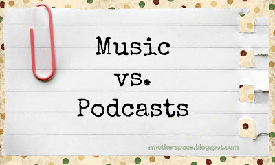
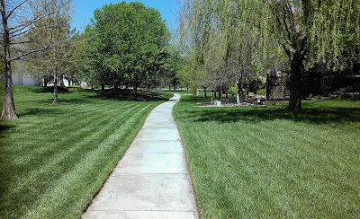
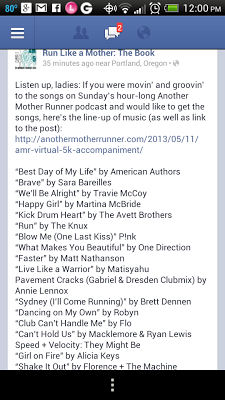

  
Lately I've been enjoying listening to podcasts while running. I'm finding that listening to a conversation distracts me from running which is what I need right now.   
  
Postpartum running hasn't been easy for me and so I need all the distractions I can get!   
  
Until recently, music was usually my main motivator while running. I love adding new music to my playlist. It motivates me because I can't wait to run and listen to the new tunes.  
  
I haven't downloaded any new music lately and I need to! Until I do though I'm sticking with podcasts. The fresh content keeps me focused on the banter and not so much on how tough running is right now.   
  
  

  
I listened to a special Mother's Day podcast on my Saturday afternoon run by Sarah and Dimity from [Another Mother Runner](http://bit.ly/YTTz4f). In it they cheered on virtual runners completing a 5K or really any other distance. I didn't officially participate in the virtual race because I wasn't organized enough to print out the bib ahead of time but I did enjoy listening to Sarah and Dimity talk about their favorite music to listen to while running and racing.   
  
The music was great and I was all prepared to listen to the podcast again (which I will probably do anyway at some point) to jot down all the songs that they featured. Today was my lucky day though because they put the list out there on facebook.  
  
  

<table align="center" cellpadding="0" cellspacing="0"><tbody><tr><td></td></tr><tr><td><a href="http://on.fb.me/YTV2aw" target="_blank">Another Mother Runner on facebook</a></td></tr></tbody></table>

  
So now, even though I'm leaning towards podcasts, I'm excited to update my playlist with some of my new favorite songs.  
  
  
  
  

**What do you listen to while running? Music, podcasts, or nothing at all**?

  
  
  
  
  
  

\------------------------------------------

  

  
Find A Mother's Pace on...  
  
Twitter [@amotherpace3](https://twitter.com/amotherspace3)  
  
Facebook [http://facebook.com/amotherspace3](http://facebook.com/amotherspace3)   
  
Instagram [amotherspace](http://instagram.com/amotherspace)  
  
RSS [amotherspace](http://feeds.feedburner.com/amotherspace)
