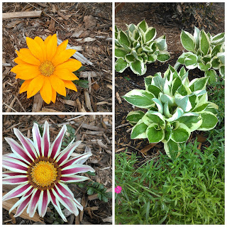
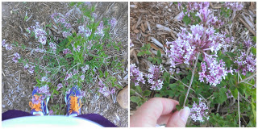
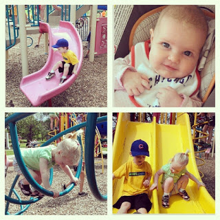

TGIF!  
  
This week I am celebrating all things OUTSIDE! It is beautiful here in Kansas and we've been able to get out and enjoy the weather lately.  
  
1\. Pretty flowers. They are blooming and growing!  
  
  

  
2\. Not so pretty flowers, yet. We planted our lilac bush last fall. It's definitely a work in progress but smells so good!   
  
  

  
3\. And with the picture above, lots of outside running. Both my husband and I have been running outside and loving it.  
  
4\. Being goofy. My daughter loves wearing mittens when it's warm outside. Strange, yes, but pretty cute!  
  
  

  
5\. Fun at the park! Our first solo trip (minus Daddy) to the park was a big success. I wasn't sure how it would go with 3 kiddos but I'm happy to say we'll make another trip soon.  
  
  

  
  
  
Are you enjoying being outside?  
  
  
Have a great weekend!
