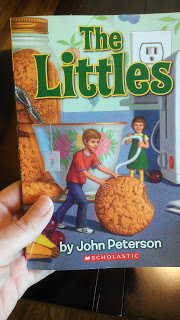
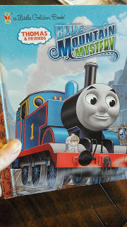
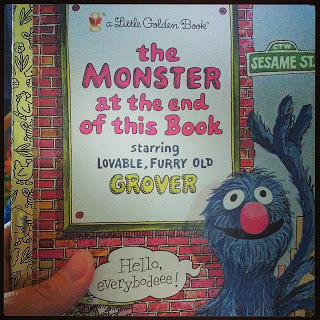
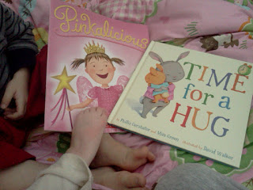
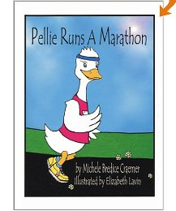

Books are an important part of our day. The kids love them so much that they often 'snuggle' with them while falling asleep. It makes a mommy proud. Here are five of our recent favorites.  
  
1\. The Littles by John Peterson  
  
  

  
This is an oldie but goodie. It's a chapter book so we only read a couple of chapters usually before nap time or bed time. We've read it twice now and a couple other Littles books as well.   
  
  
2\. Blue Mountain Mystery  
  
  

  
  
My oldest son has this book memorized. Seriously. It's pretty long but he knows it word for word. It's fun to listen to him 'read' it.   
  
  
3\. The Monster at the end of this Book  
  

<table align="center" cellpadding="0" cellspacing="0"><tbody><tr><td></td></tr><tr><td><a href="http://instagram.com/amotherspace" target="_blank">A Mother's Pace on Insagram</a></td></tr></tbody></table>

  
Another classic and we love it.   
  
  
4\. Pinkalicious by Victoria Kann and Time for a Hug by Phillis Gershator  
  
  

  
Technically this puts me over 5 books, but we'll go with 5 pictures today, yes? The lighthearted Pinkalicious is a silly and fun read. Time for a Hug is sweet and repetitive which makes it easy for the kids to interact and 'read' while we are reading it together.  
  
  
5\. Pellie Runs a Marathon by Michele Bredice Craemer  
  
  

<table align="center" cellpadding="0" cellspacing="0"><tbody><tr><td></td></tr><tr><td><a href="http://www.amazon.com/Pellie-Marathon-Michele-Bredice-Craemer/dp/0974013005/ref=wl_it_dp_o_S_nC?ie=UTF8&amp;colid=1FTCYRMLJA67K&amp;coliid=I3NO2OPF7CMW43" target="_blank">Source</a></td></tr></tbody></table>

  
A running book! It's one from our wish list. I haven't read it yet but it looks fun. I'm thinking we need to check the library for this one next time we are there.   
  
  

**If you have kids, what books are you reading over and over right now? Do you know of any other fun running books for kids? If you don't have kids, what are you currently reading?** 

Have a great weekend!  
  
  
  
  

\------------------------------------------

  

  
Find A Mother's Pace on...  
  
Twitter [@amotherpace3](https://twitter.com/amotherspace3)  
  
Facebook [http://facebook.com/amotherspace3](http://facebook.com/amotherspace3)   
  
Instagram [amotherspace](http://instagram.com/amotherspace)  
  
RSS [amotherspace](http://feeds.feedburner.com/amotherspace)
