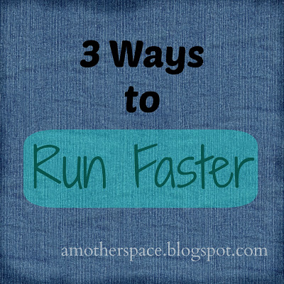
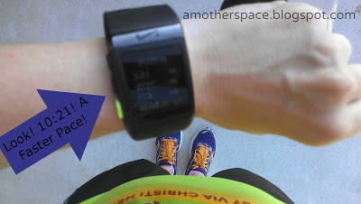
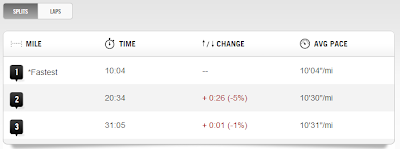
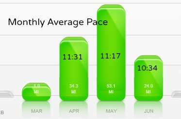

Yes, I know that the way to run faster is to, in fact, run faster. It's not easy but that's how it's done.  
  
  

  

- **Speedwork** (including tempo, fartlek, interval, ladders, etc.) It's tough work but it gives results.
- **Strength Train**. Adding strength training to your workout routine makes your body stronger. A stronger body (including upper body and core) helps you to have better form which, of course, helps with your speed.
- **Eat well**. Nourish your body with healthy foods. Bodies work best when we are good to them. Plenty of water and healthy food will make you feel better and give you the energy to complete the workouts (speedwork) needed to run faster.

  
There are many other ways to increase speed but these are the main ones for me. So that's it. Sound easy? No? It's tough but it is so worth it at the finish line.  
  
I've mentioned a time or two how frustrated I am with my post pregnancy slower paces. I have enjoyed every run but rarely in the past 3 months have I had a run that felt easy, like I could have pushed harder. That is, until Friday.  
  
  

  
My training plan called for 3 miles on Friday so I headed out for an out and back route. I'm really bad about starting out too quickly. My pace slows down throughout the run.   
  
  

  
A 30 second difference. At least I was able to maintain that pace and not slow down even more. Because that's what would have happened a month ago or _maybe even a week ago_.   
  
  

  
I started running again (after my pregnancy) on the last day of March. Since I took a few months off I knew that my pace would be higher than before and that it would go back down over time. And it's happening.  
  
So what has changed in a week?  
  
I started the Runner's World Summer Run Streak. (#RWRunStreak)  
  
Initially my plan for my 'rest' days was just to run a mile. A nice and easy mile. It is supposed to be a rest day, after all. Well, it's way too tempting right now to run a little faster during that mile because I know I can push myself and make it through the mile.  
  
So my 1 mile runs have been averaging over a minute faster than my normal runs throughout the week. Since I have been doing this I have noticed that my longer runs (from 3 to 5 miles at this point) have gone down in pace as well. I don't feel like I am exerting more energy to get the run done. I just think that my body is getting used to the faster pace because of the 1 milers.  
  
Huh, you have to run faster to run faster.  
  
This running streak essentially gave me an accidental speedwork opportunity. I'm not quite ready to implement an actual speedwork day during my running week (that starts with my training in a couple weeks!) so this has been the perfect way (for me) to speed up a little.   
  
I welcome it! I've missed running faster and I can't wait for the paces to go down even more. _I believe I can run faster again!_  
  
  
  

**Have you tried to run faster? What helped you to gain speed? I'd love to hear your tips!**

_Disclosure: Want to run faster? Ask your doctor first. I'm not a doctor and these opinions are my own._

  

\------------------------------------------

  

Staying at home with kids sounds easy, right? Life with 3 little ones is busier than I imagined. I don't write every day on the blog but I do update Facebook, Twitter and Instagram more often. 

  
Find A Mother's Pace on...

  
Twitter [@amotherspace3](https://twitter.com/amotherspace3)

  
Facebook [amotherspace3](http://facebook.com/amotherspace3)

  
Instagram [amotherspace](http://instagram.com/amotherspace)

  

Pinterest [amotherspace](http://pinterest.com/amotherspace/)

  

Bloglovin' [A Mother's Pace](http://www.bloglovin.com/en/blog/6680087)

  

RSS [amotherspace](http://feeds.feedburner.com/amotherspace)
