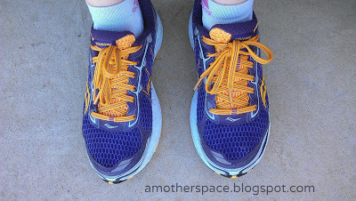
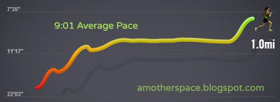
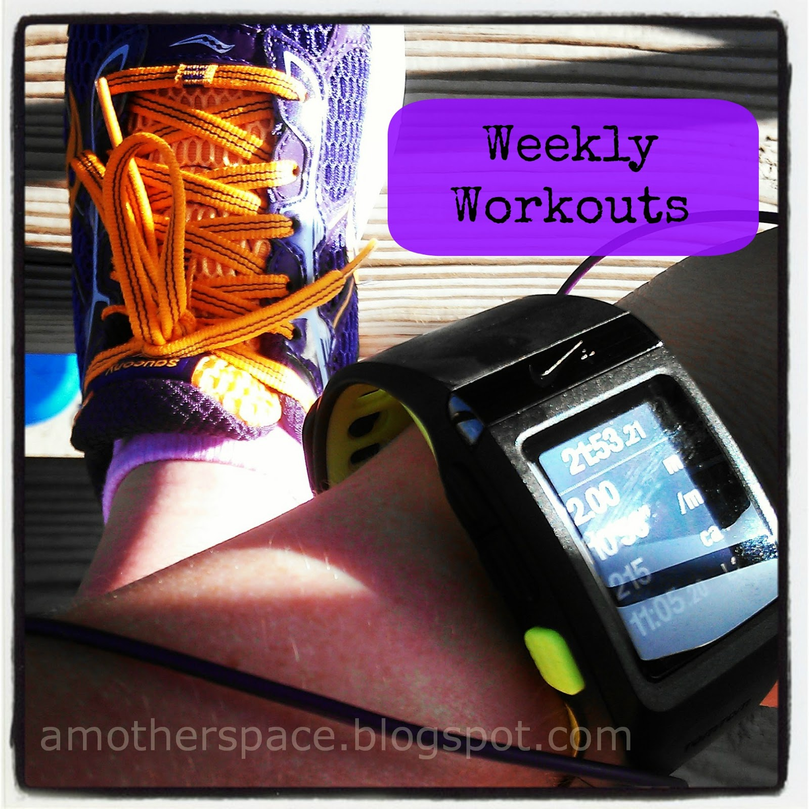
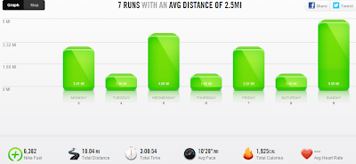

I have officially added strength workouts back into my routine. I've tried it a few times postpartum but nothing has stuck. I have a plan now, it's written down and I'm hoping that will help.   
  
  

- 6 Strength Moves from [**Laura's Mommy Run Fast blog**](http://bit.ly/13vJzNf). It's helpful that there are six moves. I don't have to look anything up to remember what to do. I've been doing all of these after my 1 mile days for the run streak.
- Core Workouts for Stronger Running from [**Runner's World**](http://bit.ly/13vK7ml). Again, there are only 5 moves here so I can remember them easily. These are a little harder for me but I'm trying to do them every other day. 
- Lastly, I read in the current issue of Runner's World that the Running Arms move with weights is a good one to help improve running form. 3 sets of 10-12 reps 2 x/week. 

By far my favorite thing about doing the strength and core work is that my children always want to exercise with me. It makes me happy they are taking an interest in it and joining in on the fun. At their own 2 and 3 year old level, of course.  
  
  
Running This Week  

  

My running from last week went well. I talked a bit about **running faster yesterday** and that has been a big factor in feeling better about running lately.

  

  

My hardest day of running was Saturday. It was a busy day and I had planned to wake up at 5:30 a.m. to get my 1 mile in for the #RWRunStreak. When my alarm went off I was too tired. Way too tired. Before I knew it the day was almost over, the kids were in bed, we had thunderstorms outside and I needed to run. So I did it on the treadmill at 9:10 p.m. But I did it, I'm still streaking!

  

  

Not only did I run but I ran my fastest postpartum mile yet. Wahoo! 

  

My favorite run of the week was on Sunday. My 'long' run (it feels weird calling 5 miles long!) so I took it out of our neighborhood and down a shady street that I haven't ran on since before I was pregnant. That would have been about a year ago. I've missed that route because of the shade but also because of the other runners. I always say "Good Morning" as I come across people but today another man told me "Good morning, good job!" That just made my run.

  

  
Weekly Workouts  
  
Monday: 3 mile run (10:53 pace)  
  
Tuesday: 1 mile run (9:31 pace), Strength Training  
  
Wednesday: 4 mile run (10:51 pace)  
  
Thursday: 1 mile run (9:11 pace), Strength Training  
  
Friday: 3 mile run (10:21 pace)  
  
Saturday: 1 mile run (9:01 pace)  
  
Sunday: 5 mile run (10:47 pace), Strength Training and Core Work  
  
Total Running Miles: 18  
Weekly Average Pace: 10:28   
  
  

  
  
  

Do you strength train? How about core work? What is your weekly mileage? How do you keep track? Log book? Website? Other?

Lots of questions today!

  
  
  
  
  

\------------------------------------------

  

  
Find A Mother's Pace on...  
  
Twitter [@amotherpace3](https://twitter.com/amotherspace3)  
  
Facebook [http://facebook.com/amotherspace3](http://facebook.com/amotherspace3)   
  
Instagram [amotherspace](http://instagram.com/amotherspace)  
  
RSS [amotherspace](http://feeds.feedburner.com/amotherspace)
