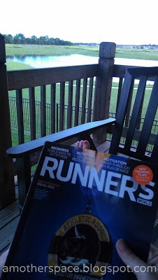
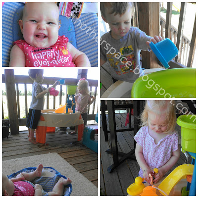
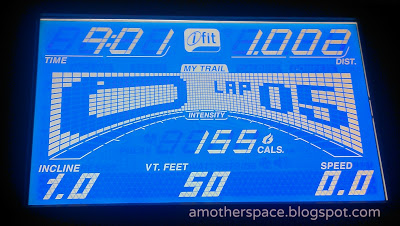

I can't say enough about the July issue of Runner's World. 

  
I started it out on my back deck during a nice relaxing evening with just me and my magazine. I've dogeared so many pages. Even without the bombing coverage the magazine issue is top notch. Well done, Runner's World.  
  
My little girl is getting so big! Time goes by so quickly that I don't even care that most days my hair and makeup don't get done.  
  
  

  
She's a lot of fun right now with smiles and laughing but she's also super sweet when she's sleeping.  
  
  

  
So precious. I can't imagine life without her.  
  
We've been enjoying the shade of the back deck. It's hard with a 3 month old to adequately cover up out in the sun and our yard doesn't have much shade. So we stick to the deck during the hot part of the day. The water table is a favorite!  
  
  

  
Even Little E loves to watch the splashing.   
  
I had my fastest postpartum 1 mile this week.  
  
  

  
A 9 minute mile! I just kept increasing the belt speed throughout the run and I didn't back down. It was fun but it was only a mile. I have a ways to go until I can bring my longer runs down in pace.  
  
We had a hot and muggy trip to the zoo. We arrived early and spent some time at the inside (air conditioned!) exhibits. The zoo is one of our favorite places and we haven't been there nearly enough lately. Our favorite animals on this trip were the peacocks and a loose snake on the sidewalk. Eeek!!  
  
  

  
  
  
  

**Have you read Runner's World this month? What do you think about their coverage? If you have a baby, how do you escape the sun and the heat of the summer?**

  
  

\------------------------------------------

  

  

  
Find A Mother's Pace on...  
  
Twitter [@amotherpace3](https://twitter.com/amotherspace3)  
  
Facebook [http://facebook.com/amotherspace3](http://facebook.com/amotherspace3)   
  
Instagram [amotherspace](http://instagram.com/amotherspace)  
  
RSS [amotherspace](http://feeds.feedburner.com/amotherspace)
