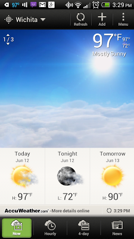
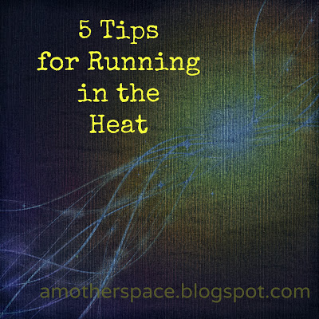
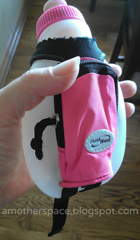

I've decided that I am very much a cold weather person. I'll take running in the snow over a 90+ degree run any day of the week.   
  
But it's summer time and it finally really feels like it.  
  
It hit the 90's here in Wichita this week. I shouldn't complain because that's pretty late in the year for us.   
  
  

  
This just makes me want to sit by the air conditioning vent.   
  
Honestly, I try and avoid running outside in the heat of the day when it is this hot outside. But the humidity and heat are starting to affect my morning running time as well.   
  
As I'm writing this post I happened to look out my window as a man ran by on our lake path. It's 3:45 and 97 degrees out right now. He evidently beats the heat by wearing sunglasses and not wearing a shirt. He's not carrying a water bottle. Kudos to him but it's definitely not for me! I'm curious to see how long he lasts...  
  
But, I digress.   
  
  

  
**Run early in the day.**  
I usually run in the early morning because it works well with my schedule. During the summer it becomes even more important to get up when my alarm goes off super early because I know that running in the evening heat will not be pleasant.  
  
**Stay hydrated on your run.**  
  
Carry water with you, run by water fountains or make sure you have other sources. Right now I mainly carry a hand held water bottle. My [10 oz. fuel belt bottle](http://amzn.to/11ajDHo) has seen me through many miles.   
  
  

  
It works perfectly on any run up to 4 miles. After that I need to refill the bottle (water fountains in parks are perfect) or do an out and back route from my car.  
  
I'm also considering buying a running hydration pack. Any tips? I'd love to hear recommendations.  
  
**Stay hydrated before your run.**  
Make sure you are drinking enough water daily. Especially on the day before a long run.   
  
A recent study highlighted by the Chicago Tribune says that 43% of adults drink less than 4 cups of water a day. Find the article [**here**](http://bit.ly/19rwI3A). 43%!   
  
**Wear proper clothing.**  
I wear dri-fit clothing year round but I can't imagine running without it during the summer. Wicking fabric is a must from the hat on my head down to the socks on my feet.  
  
**Carry a small towel.**  
I hate sweat dripping into my eyes so when it is hot outside I carry a thin baby wash cloth along with me. It tucks nicely into my shorts and is easy to pull out when needed.   
  
  
Oh, and that man running that I mentioned earlier? He ended up running 6 laps which is about 2 miles. He walk/jogged the last two. I would love to know what his plan was before he walked out the door and whether or not the heat changed his run.   
  
  
  

**How do you beat the heat? Do you carry a hydration pack? If so, I'd love to hear how you like it.**

  
  

  

\------------------------------------------

  

Staying at home with kids sounds easy, right? Life with 3 little ones is busier than I imagined. I don't write every day on the blog but I do update Facebook, Twitter and Instagram more often. 

  
Find A Mother's Pace on...

  
Twitter [@amotherspace3](https://twitter.com/amotherspace3)

  
Facebook [amotherspace3](http://facebook.com/amotherspace3)

  
Instagram [amotherspace](http://instagram.com/amotherspace)

  

Pinterest [amotherspace](http://pinterest.com/amotherspace/)

  

Bloglovin' [A Mother's Pace](http://www.bloglovin.com/en/blog/6680087)

  

RSS [amotherspace](http://feeds.feedburner.com/amotherspace)
