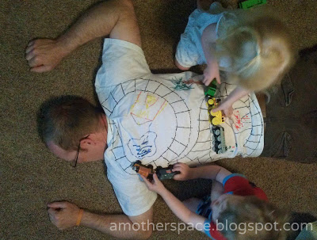
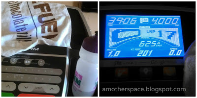
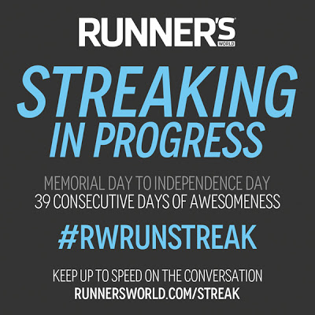

Father's Day ended up being a great day at our house. We gave him a pretty fantastic present.   
  
  

  
The kids enjoyed coloring in the houses and trees and driving the trains on Daddy's back. Daddy got a little back massage out of the deal.  
  
My long run was Sunday morning so I headed out and Daddy made the kids a special Father's Day breakfast.  
  
We also spent time at the pool. Daddy grilled out a delicious steak dinner and we just relaxed at home.   
  
**Best Run of the Week**  
  
Friday's treadmill run.   
  
Friday morning I woke up, got ready to run and headed outside. As I was going through our back gate something made me realize that we forgot to go to the store the night before. We were out of practically all of our staples and _needed_ to go to the store. I reluctantly turned around and headed back inside so my husband could run to the store.   
  
Right after work I was able to head downstairs to the treadmill. It was entirely too hot outside so I had to run on the treadmill. I was not looking forward to it at all but I needed to get my run in.   
  
I'm pretty sure this was my best run of the week because it felt so easy and my pace was the best it's been postpartum.  
  
  

  
I also covered up the screen on the treadmill and that made a huge difference! I'm doing that from here on out.  
  
**Worst Run of the Week**  
Sunday's long run.  
  
There used to be a time when my long run was almost always my favorite run of the week. Lately they've just been tough and they really aren't that long yet! I started out later than I had intended so it was warm outside. That didn't help.   
  
The negative thoughts started creeping in pretty soon after I began running. "You're not feeling it today you can turn around early. You don't need to do 6 miles, you can turn around at 2.5" etc... I tried to ignore it the best I could and I did end up completing the entire 6 miles. It's probably a good thing I did an out and back because I'm sure I wouldn't have made it otherwise.  
  
It does worry me that I had such a hard time with a measly 6 miles when I'm just at the beginning of my training. I just have to remind myself that everyone has bad runs every now and again.   
  
**Runner's World Summer Run Streak Update**  
  
  

  
I'm still streaking! Day 22 was this morning. I'm over half way finished and I'm not sick of running yet. There have been a few days where it's been a challenge to find the time to squeeze in a mile but I did it.   
  

  
**Weekly Workouts**  
  
Monday: 1 mile run (9:42 pace), Strength Training  
  
Tuesday: 2 mile run (10:50 pace)  
  
Wednesday: 1 mile run (9:55 pace), Strength Training  
  
Thursday: 3 mile run (11:05 pace)  
  
Friday: 4 mile run (9:46 pace)  
  
Saturday: 1 mile run (9:22 pace), Strength Training and Core Work  
  
Sunday: 6 mile run (11:41 pace)  
  
Total Running Miles: 18  
Weekly Average Pace: 10:08   
  
  

  
  

**What do you do to ignore the negative voice in you during a run? Any streakers out there? How's it going for you?**

  
  
  
  
  
  

\------------------------------------------

  

  
Find A Mother's Pace on...  
  
Twitter [@amotherpace3](https://twitter.com/amotherspace3)  
  
Facebook [http://facebook.com/amotherspace3](http://facebook.com/amotherspace3)   
  
Instagram [amotherspace](http://instagram.com/amotherspace)  
  
RSS [amotherspace](http://feeds.feedburner.com/amotherspace)
