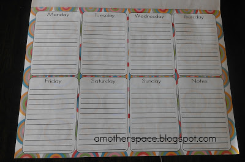
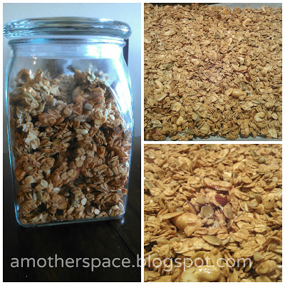

I'm embarrassed to say that a year ago my eating habits were much better than they are right now.   
  
In the months leading up to my last pregnancy our family had switched over to mainly eating real food. We cut out most of the processed food from our diet and felt great about it. I was making salad dressings, granola, tortillas and so many other healthy snacks for our family.   
  
Then I became pregnant and it really went downhill from there. I wish I was the type of person to crave veggies and a variety of healthy foods when pregnant but that is so not the case. My favorites were ice cream, chips, and Mexican food just to name a few. Even if I wanted to eat something healthy I had no energy to be in the kitchen.  
  
The food prep at home has gotten healthier since Little E was born but that isn't what I'm worried about at this point.  
  
Last week I realized that we were (still) eating out way too much. We weren't really buying junk from the grocery store but we were eating out at restaurants too frequently. I know we are busy with 3 kids but it was getting a little ridiculous.   
  
  

  
I'm back to menu planning. This thing has been blank or partially filled for too many weeks/months and it makes all the difference.   
  
  

  
I made granola and it's delicious. I've missed it. The kids and my husband have missed it too. You can find the recipe over on one of my favorite 'real food' blogs, [**100 Days of Real Food**](http://bit.ly/17WqzMe). We've been eating it for breakfast and for snack over yogurt. So good!  
  
  

  
We're taking baby steps to get back into eating real food because it's overwhelming to do it all at once. _But it is so important_. I wish we didn't have to worry about harmful ingredients in food that we buy at restaurants and grocery stores but we do.   
  
So, that's it, that's the big change. We're back to healthy eating over here. I like to know what is in my food and the easiest way to do that is by making it myself. (Actually, the _easiest_ way is for my husband to do it! He's a great cook and helps out all the time in the kitchen.)  
  
  

**Do you eat 'real food' and make your own? If so do you have any favorite snack recipes to share?** 

  
  
  
  

\------------------------------------------

  

Staying at home with kids sounds easy, right? Life with 3 little ones is busier than I imagined. I don't write every day on the blog but I do update Facebook, Twitter and Instagram more often.   
  
Find A Mother's Pace on...  
  
Twitter [@amotherspace3](https://twitter.com/amotherspace3)  
  
Facebook [amotherspace3](http://facebook.com/amotherspace3)  
  
Instagram [amotherspace](http://instagram.com/amotherspace)  
  
Pinterest [amotherspace](http://pinterest.com/amotherspace/)  
  
Bloglovin' [A Mother's Pace](http://www.bloglovin.com/en/blog/6680087)  
  
RSS [amotherspace](http://feeds.feedburner.com/amotherspace)
