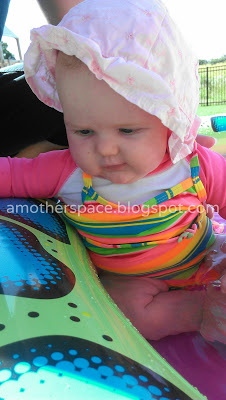
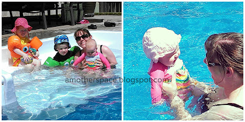
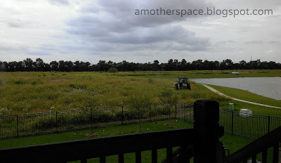
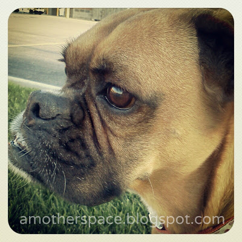

My 'five' this week is heavy on the kids and light (or really nonexistent) on the running. Maybe that's because I've had a week of blah running?  
  
1\. We discovered that my 3.5 month old and my 2.5 year old can share a swimming suit. I've got a chunky monkey and a skinny minnie. (Said with much love for both shapes!)  
  
  

  
I don't have a picture of my older daughter in the swimsuit from this year but she has worn it. It's the striped one in the photo above.  
  
2\. Pool time is pretty fun with all the kids. Little E giggles in the water but can't be out in it very long because of the sun. Little A loves to play with toys in the shallow area. Little O loves to splash and jump in the water.   
  
  

  
3\. They've mowed our field.  
  
  

  
I understand why. It's a fire hazard, I know. But it was so pretty. I guess I'll look forward to the clover and grasses next summer again!  
  
4\. Little E is playing with so many toys lately. It means she can interact more with the older two and we're having so much fun! I love to see all the kids playing together!  
  
  

  
5\. This weekend marks a year that we've been without our beloved dog, Mika.  
  
  

  
I miss her every day. I wonder how our kids would be different if we still had a dog. Little A is actually _scared_ of dogs. I don't believe she would be if we still had Mika. Both kiddos still bring up Mika. In fact, just the other day Little O mentioned the day she died to us.   
  
Will we get another dog? I'm not sure. It's heartbreaking when you out live a dog. It's hard to travel with a dog. But the benefits outweigh these reasons so I wouldn't be too surprised if we had another dog in our house after Little E gets a little older.   
  
  
  

**Do you have a dog at home with small children? Have you been enjoying the pool this summer?**

  
  
  
  

\--------------------------------------

  

  
Find A Mother's Pace on...  
  
Twitter [@amotherpace3](https://twitter.com/amotherspace3)  
  
Facebook [http://facebook.com/amotherspace3](http://facebook.com/amotherspace3)   
  
Instagram [amotherspace](http://instagram.com/amotherspace)  
  
RSS [amotherspace](http://feeds.feedburner.com/amotherspace)
