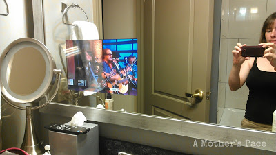
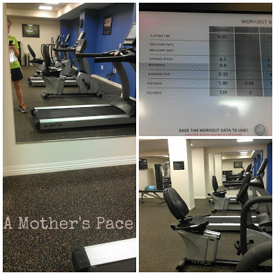
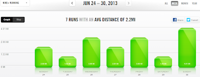

One of the first things I think about when planning a vacation is where I'll be able to run. I _love_ running in a new environment because it mixes things up a bit which makes it more exciting.   
  
This past week we traveled to Iowa for a family wedding. We stayed at two different hotels and then at my dad's house. I was able to run in 4 different cities throughout my traveling. Today I'll touch on the hotel fitness room running and soon I'll tell you all about my outdoor adventures including bridges, hills and crossing state lines.  
  
The first hotel was a Courtyard Marriott. I wasn't really sure of the area of town and I was limited on time so I went to the fitness room to run my speed work for the week.  
  

  
It was a typical fitness room with some weights, an elliptical and a couple of treadmills. Oh, and ugly carpet.  
  
But the run was fun. I think I like doing speed work on a treadmill. My treadmill at home doesn't give me pace per mile but this one did which was fantastic for what I was trying to do.   
  
I started out with a warm up running 10 minute miles and then did 30 to 40 second pick ups at a 7:30 to 8:00 minute pace. I ran six of these with a 10 minute pace in between. It's a workout straight from the [Train Like a Mother](http://amzn.to/10eETuP) Half Marathon plan.  
  
Unfortunately I have no idea what my overall pace was because I accidentally hit stop instead of pause on the treadmill in the middle of the run. My Nike+ app told me I did it in 23 minutes (3 miles) but I don't believe that at all.   
  
Our next hotel was the beautiful Blackhawk in Davenport, Iowa.  
  

  
It was pretty fancy, like 't.v. in the bathroom mirror' kind of fancy. Little O thought that was just about the coolest.   
  

  
It was my 1 mile rest day so I just ran on the treadmill in the fitness room.  
  

  
This fitness room was big and the treadmills were amazing. You could download your information to a USB if you wanted. I know, I'm easily impressed! It also told me my current pace and had a great data screen at the end of my run.  
  
  

  
**Weekly Workouts**  
  
Monday: 2 mile run, Strength Training  
  
Tuesday: 1 mile run  
  
Wednesday: 3 mile run, Core Work  
  
Thursday: 2 mile run   
  
Friday: 3 mile run (Speed Work)  
  
Saturday: 1 mile run   
  
Sunday: 4 mile run   
  
  

  
  

  
Total Running Miles: 16  
Weekly Average Pace: 10:42  
  
June Running Miles: 75  
2013 Running Miles: 144.38  
  
  

  
  

  

\------------------------------------------

  

  
Find A Mother's Pace on...  
  
Twitter [@amotherpace3](https://twitter.com/amotherspace3)  
  
Facebook [http://facebook.com/amotherspace3](http://facebook.com/amotherspace3)   
  
Instagram [amotherspace](http://instagram.com/amotherspace)  
  
RSS [amotherspace](http://feeds.feedburner.com/amotherspace)
