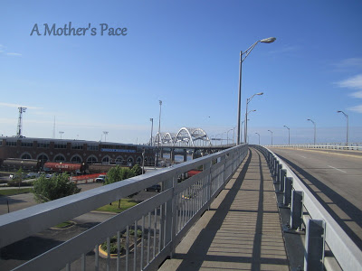
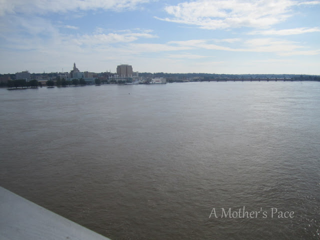
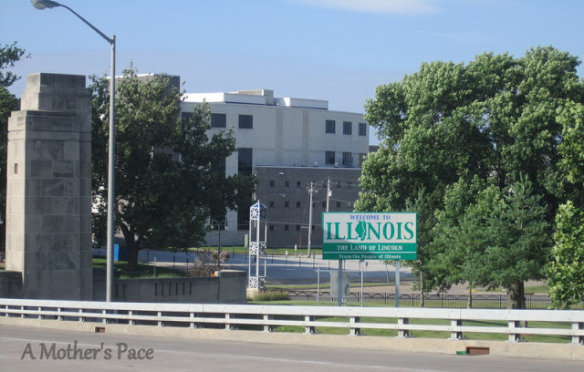
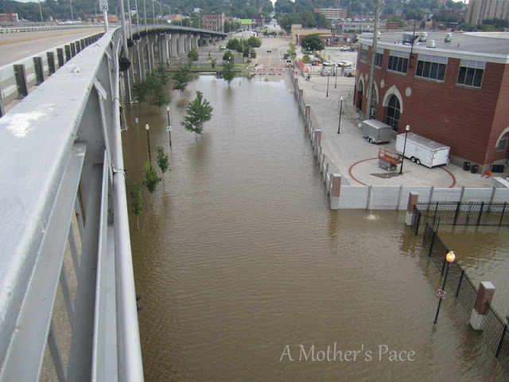

We are back from our Iowa vacation and had a wonderful time visiting family, friends and of course I spent some of that time running!  
There was a little [hotel treadmill running](http://bit.ly/13w0bXS). But more importantly there were beautiful outside runs as well.   
  
My five this week is all about running in Davenport, Iowa.  
  
1\. We had a grandpa to babysit the kiddos so my husband and I were able to run the streets of Davenport together.  
  
  

  
2\. We ran a hilly route on a bridge.  
  
  

  
3\. The bridge crossed over the Mississippi. Beautiful.  
  
  

  
4\. When we ran over the bridge we crossed state lines and ended up in Moline, Illinois. First time I've ever crossed a state line while running.  
  
  

  
5\. Roads were closed because of the flooding. The water was up pretty high.  
  
  

  
I would have never picked to run over the bridge. My husband suggested it and even though the bridge was a tough run it was gorgeous. I'm so glad we did it!  
  

**Have you ever crossed state lines while running?**

  

  

\-------------------------------

  

  

  

Find A Mother's Pace on...

  
Twitter [@amotherspace3](https://twitter.com/amotherspace3)

  
Facebook [amotherspace3](http://facebook.com/amotherspace3)

  
Instagram [amotherspace](http://instagram.com/amotherspace)

  
Pinterest [amotherspace](http://pinterest.com/amotherspace/)

  
Bloglovin' [A Mother's Pace](http://www.bloglovin.com/en/blog/6680087)

  
RSS [amotherspace](http://feeds.feedburner.com/amotherspace)
