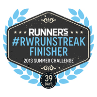
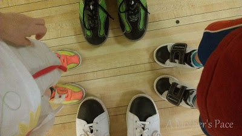
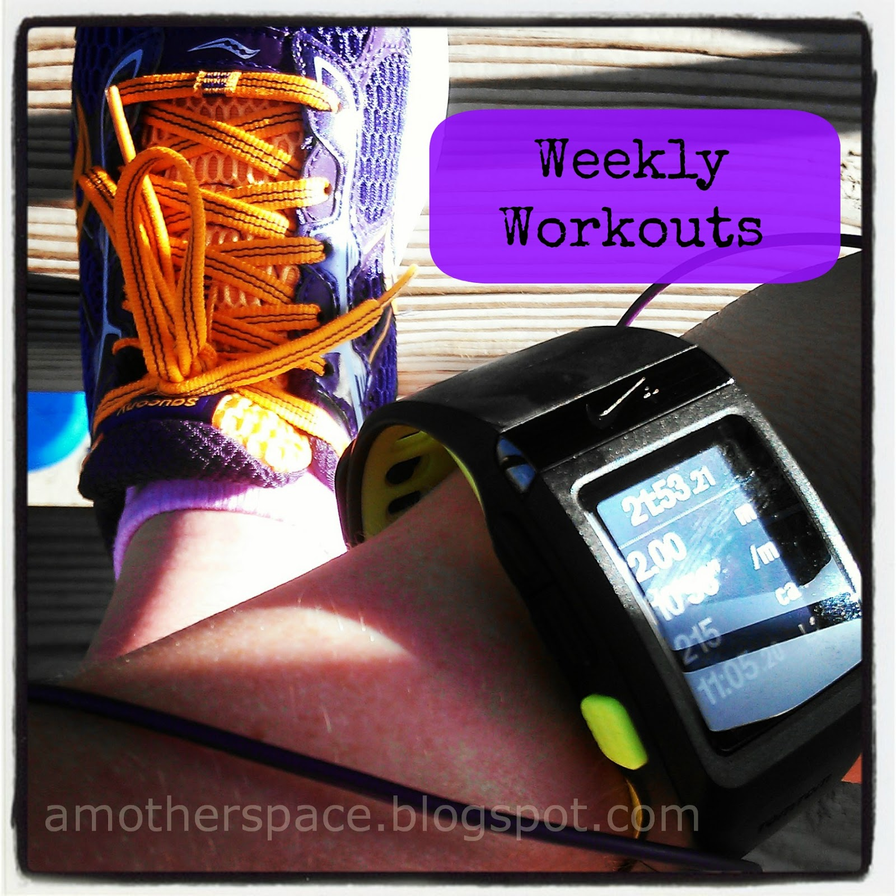
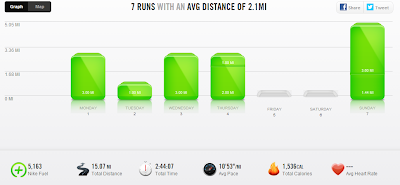

Well the Runner's World Summer Run Streak (#RWRunStreak) is officially over.   
  
I'm a finisher!  
  
  

When I started the streak on Memorial Day, July 4th seems so far away and I doubted that I would be able to complete it. 39 days later I was still streaking and, more importantly, still enjoying running.  
  
In fact, on Friday when I decided not to run, it was a difficult decision. I kept thinking I could squeeze a run in somewhere throughout my day but then I realized that a day off of running might not be the worst thing for my body.   
  
I went bowling instead. I'm not a good bowler by any stretch of the imagination but more on that later.   
  
  

  
Occasionally it was difficult to hit the pavement every day but overall it wasn't that tough. I also think that the streak helped me to actually do more strength training and core work. My 1 mile runs on 'rest' days ended up being the perfect warm up for strength or core work.   
  
The streak definitely helped me to stay active while on vacation. I usually run while traveling but not every day. Traveling with 3 kids under 4 is challenging enough but trying to add running for both myself and my husband into the mix was a little crazy. It worked out though and we both were able to complete some good quality runs.  
  
It was also fun to interact with other streakers through Twitter. I loved seeing how people were able to find time to run. @megrunnergirl actually ran a mile in her parking garage to keep the streak going!   
  
A few numbers for the run nerd in me.  

- I ran 15 1 milers. This means I basically ran 15 more times than I would have normally during this time period.
- I ran a total of 94 miles throughout the streak.
- I actually ran 40 days in a row because I ran a race the day before I started the official Runner's World streak. 40 days and 98.22 miles.

I'm only days out from the summer run streak and I'm already looking forward to the winter streak hosted by Runner's World!   
  
  

  
**Weekly Workouts**  
  
Monday: 3 mile run, Hills  
  
Tuesday: 1 mile run  
  
Wednesday: 3 mile run, Hills  
  
Thursday: 3 mile run (2 miles: stroller run with Little O)  
  
Friday: First rest day in 40 days!  
  
Saturday: busy day, missed my run  
  
Sunday: 5 mile run   
  
  

  
Total Running Miles: 15  
Weekly Average Pace: 10:53  
  
July Running Miles: 15  
2013 Running Miles: 159.38  
  
Check back tomorrow for bowling and baseball. An extra blog post to share some fun 'firsts' for our kids.  
  
  
  

**Did you make it through the streak? How many miles did you log? What was your favorite/least favorite thing about streaking?**

  

  

\------------------------------------------

  

  
Find A Mother's Pace on...  
  
Twitter [@amotherpace3](https://twitter.com/amotherspace3)  
  
Facebook [http://facebook.com/amotherspace3](http://facebook.com/amotherspace3)   
  
Instagram [amotherspace](http://instagram.com/amotherspace)  
  
RSS [amotherspace](http://feeds.feedburner.com/amotherspace)
