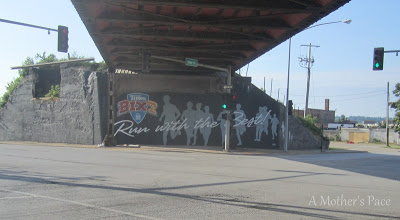
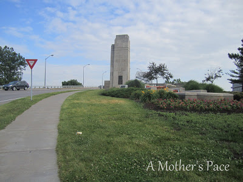
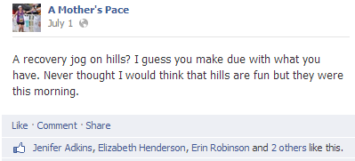
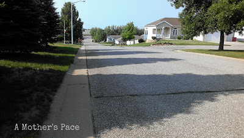
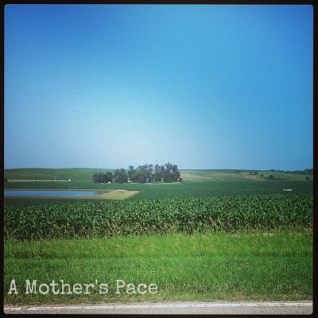
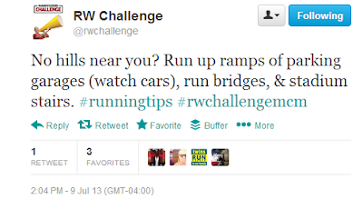

I live in Wichita, Kansas. I hate to support the sterotype out there that Kansas is flat because there certainly are some parts that are not (Flint Hills for example). That said, Wichita is FLAT. The areas of town that I run in are FLAT.  
  
Hill workouts are typically not in my rotation mainly due to the fact that there aren't any around me.  
  
Last week we traveled to Iowa for a family wedding and I found my hill workouts.  
  
  

  
The first major hill was my run over the [Mississippi River](http://bit.ly/17YcnU1). It was a beautiful run and you can click the previous link to read more.  
  
  

  
I ran with the best (my husband) who had the great idea to run up and over the bridge.   
  
  

  
If I'm going to run on a hill I have to run it at a faster pace. I'm not sure why but it's easier for me. I slow way down once I get to the top but picking up the pace helps me get up the hill.  
  
I also ran in Lawton, Iowa. It's a little town and you can't escape running the hills there.   
  
My training the Monday of vacation called for a recovery jog. So I very slowly ran my recovery jog on hills.  
  
  

  
And, you know what? It was fun. Hills added just enough variety to my run that I didn't really notice the hills and enjoyed the run.  
  
I also tried a specific 'hill workout' instead of my typical speedwork for the week. It ended up being a 3 mile run.  
  
I ran a 1 mile warm up that had 1 medium sized hill in the middle. Then I arrived at the hill I picked for repeats.  
  
  

  
This photo is from the top, looking down. It doesn't look like much but it was a nice steady slope of a hill. It also dipped in the middle and then went back up at the end of this street.  
  
I ran up the first hill then the second. I turned around and did it again two more times. I wanted to do more but it was tough so I decided to do another 1 mile loop and come back for another hill.  
  
I was sweating, it was rough but I loved it. I'll take hills over the Kansas wind any day!  
  
  

  
  
Yesterday from Twitter:  
  

  
Timely, but ugh, no thank you.  
  
Looking for more information on how to tackle hills? Check out Another Mother Runner's Tell Me Tuesday: [Climbing with Confidence](http://bit.ly/14Ht1mf).  

  
  
  

**Do you run hills regularly?** 

  
  

\------------------------------------------

  

  
Find A Mother's Pace on...  
  
Twitter [@amotherpace3](https://twitter.com/amotherspace3)  
  
Facebook [http://facebook.com/amotherspace3](http://facebook.com/amotherspace3)   
  
Instagram [amotherspace](http://instagram.com/amotherspace)  
  
RSS [amotherspace](http://feeds.feedburner.com/amotherspace)
