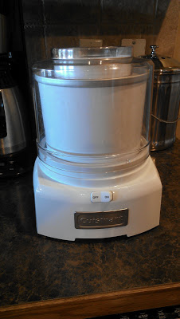
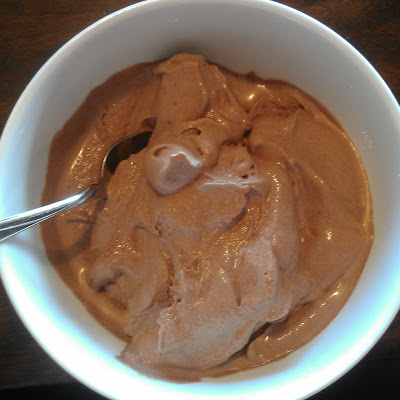

In my quest to provide 'Real Food' for my family I have always struggled with ice cream. It is probably my favorite food. Well, maybe I like Sushi better but ice cream is definitely my favorite dessert.  
  
If I have ice cream in the house then I eat it. I really have no self control and it's gone in just a few days. So, I typically don't buy it.   
  
Lately though it seems like we have had it in the house a lot. It started with my pregnancy. And it was a craving that didn't end after the pregnancy ended.   
  
Have you read the ingredients list on ice cream?   
  
It pains me to know that something so delicious is really not that good for me, even in moderation. But ice cream is probably the hardest thing for me to give up completely and I know my kids love it too.  
  
So I've started to make my own. Sure, it is still high in calories but there is nothing wrong with that if eaten in moderation.  
  
  

  
I bought an ice cream maker with a gift card from my birthday (thanks, Mom!) and my husband made us ice cream the next night.   
  

  
We started off easy with a batch of chocolate.   
  
  

  
I can't wait to play around with more flavors.   
  
  

  
  
  
  

**Have you tried to make your favorite foods with 'real' ingredients?**

  
  

  

\------------------------------------------

  

  
Find A Mother's Pace on...  
  
Twitter [@amotherpace3](https://twitter.com/amotherspace3)  
  
Facebook [http://facebook.com/amotherspace3](http://facebook.com/amotherspace3)   
  
Instagram [amotherspace](http://instagram.com/amotherspace)  
  
RSS [amotherspace](http://feeds.feedburner.com/amotherspace)
