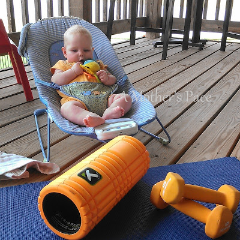
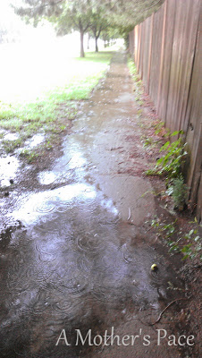
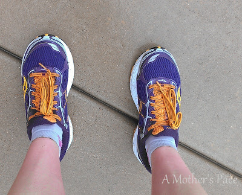
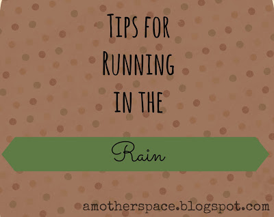
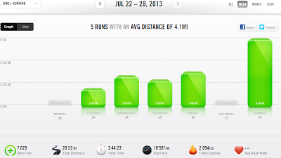
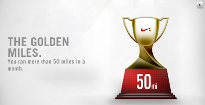

Finally, I've had an almost normal week of running. At least I was able to fit in all my main workouts and then I shuffled around a couple of easy and rest days to make it work.   
  
My favorite workout of the week was a strength and core workout on my back deck.  
  
I had this cute little face cheering me on.  
  
  

  
My moves with the weights made her smile and giggle. Being laughed at while exercising isn't such a bad thing, right?  
  
My long run on Sunday was WET! I postponed it because it was unseasonably cool out and I was hoping that the rain would ease up a bit before I headed out.   
  
Wrong.  
  
It just kept coming down.   
  
Instead of running 8 miles inside on the treadmill I ventured outside prepared to dread my entire run but hoping that it wouldn't be as bad as I thought it would be.  
  
Unfortunately, it was pretty bad.  
  
I had to switch my route at one point because the sidewalks were completely flooded.   
  
The new route that I picked was better but not great. I still spent way too much time and effort into dodging puddles and running through muddy grass to avoid sidewalks flooded out by water.   
  
  

  
I learned today that my headphones don't work well when they get wet. They slipped out of my ears all the time and I was constantly readjusting them. Finally, I gave up, took them off and stored them in my hydration pack.  
  
I was cold and couldn't have been more wet if I was aqua jogging. I'm sure people thought that I was crazy as they were driving by.  
  
I only saw one other runner while I was out. This is very unusual and it made me feel a little like a BAMR!  
  
I will say that I was never bored during this run. The run took longer but it seemed shorter because I was distracted by all the challenges the rain gave me.  
  
And in the end when I took my waterlogged shoes off I figured I would have blisters all over my feet. But, amazingly, NO BLISTERS!   
  
  

  
The only way that I got through my run was by telling myself over and over that this is good preparation for a rainy race day. A few things I did made this run go as smoothly as it could.  
  
  

  

- Wear Body Glide.
- If you have a phone put it in a baggie.
- Wear clothes that you would normally wear for the temperature. Don't add layers because of the rain. 
- Leave the headphones at home. (I learned this one yesterday!)

  

  

  
**Weekly Workouts**  
  
Monday:  Cross Training stair workout (Does that count?!) 20 minutes, Core Work  
  
Tuesday: 2 miles  
  
Wednesday: 3.5 miles (3 miles plus 6 strides), Core Work  
  
Thursday: 3 miles  
  
Friday: 4 miles (10 min WU, 6 x 1 min/ 2 min recovery, 10 min CD), Strength Training and Core Work  
  
Saturday: Rest  
  
Sunday: 8 miles (long run), Core Work  
  
  

  
  

  
Total Running Miles: 20.52  
Weekly Average Pace: 10:56  
  
  

  
July Running Miles: 64.40  
2013 Running Miles: 208.78  

  

**Do you like running in the rain? What other tips would you add to my list?**

  
  

  

\------------------------------------------

  

Staying at home with kids sounds easy, right? Life with 3 little ones is busier than I imagined. I don't write every day on the blog but I do update Facebook, Twitter and Instagram more often. 

  
Find A Mother's Pace on...

  
Twitter [@amotherspace3](https://twitter.com/amotherspace3)

  
Facebook [amotherspace3](http://facebook.com/amotherspace3)

  
Instagram [amotherspace](http://instagram.com/amotherspace)

  

Pinterest [amotherspace](http://pinterest.com/amotherspace/)

  

Bloglovin' [A Mother's Pace](http://www.bloglovin.com/en/blog/6680087)

  

RSS [amotherspace](http://feeds.feedburner.com/amotherspace)
