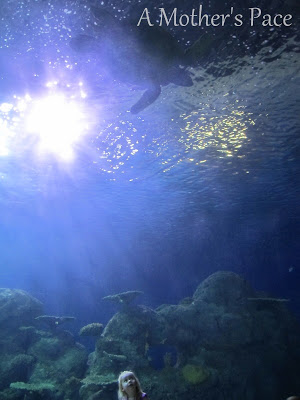
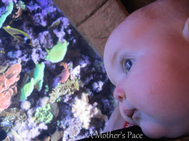
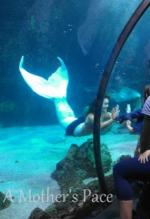
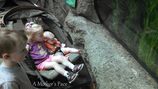
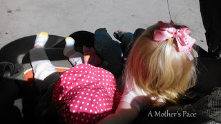
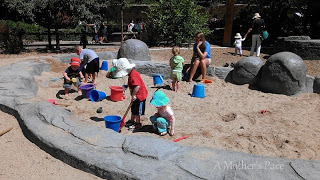
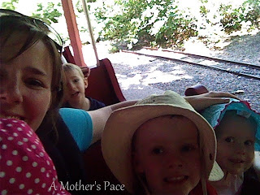
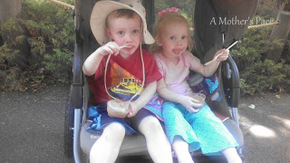

Vacation with 3 kids 3 and under is interesting. Hanging out in a strange city while my husband works for several days is challenging. We made the best of it and enjoyed our visit to Colorado. I can't wait to head back again!  

  

We filled our days with museums and zoos. I'm realizing as I'm writing this that I've picked out a lot of pictures to share. (Although, I took about 800 more, consider yourself lucky??)  So, this post is part one of our vacation and tomorrow (hopefully!) I'll be back with part two.

  

Day 1: Denver Aquarium

  

  
I love this photo of Little A and the huge sea turtle. It's probably my favorite shot of the entire trip. That particular aquarium was amazing and we spent a lot of time in front of it.  
  
  

  

Even Little E loved the aquarium. So many lights and movements inside each aquarium.  

  

  
We happened to catch the Mermaid performance while we were going through. It was a highlight of the visit. Little O talked about mermaids for days after this.  
  

  

Most of the aquariums were low to the ground. This was perfect for us because I didn't have to lift the kiddos up to see anything and they could stay in the stroller if they wanted. 

  

Day 2: Denver Zoo

  

It was a pretty hot day outside in Denver but that didn't stop us from spending 7.5 hours at the zoo. Yes, I said 7.5 hours!! We didn't even make it to all the exhibits. A fantastic zoo, I would go there again in a heartbeat.

  

  
Little A loved riding in the stroller with her baby sister. It's so sweet that she always wanted to put her arm around her.   
  

  
We stumbled upon the sand pit and the big kids played in it for a long time while Little E and I hung out during one of her naps. The big shovels were so much fun!  
  
  

  
One of the highlights of the zoo was, of course, the train. We all squeezed into one seat and enjoyed every second of the ride.  
  
  

  

I rarely need an excuse for ice cream so it was definitely in order during our steamy day at the zoo. Sadly, Little A's shirt will never be the same. 

  

Back with more from our trip tomorrow! Have a great day!

  

  

\-------------------------------------

  

Staying at home with kids sounds easy, right? Life with 3 little ones is busier than I imagined. I don't write every day on the blog but I do update Facebook, Twitter and Instagram more often.   
  
Find A Mother's Pace on...  
  
Twitter [@amotherpace3](https://twitter.com/amotherspace3)  
  
Facebook [http://facebook.com/amotherspace3](http://facebook.com/amotherspace3)   
  
Instagram [amotherspace](http://instagram.com/amotherspace)  
  
RSS [amotherspace](http://feeds.feedburner.com/amotherspace)
