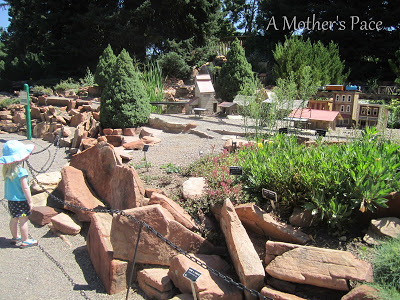
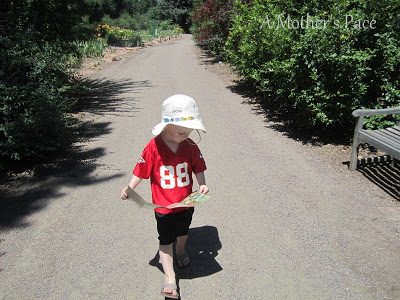
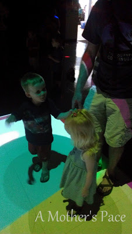
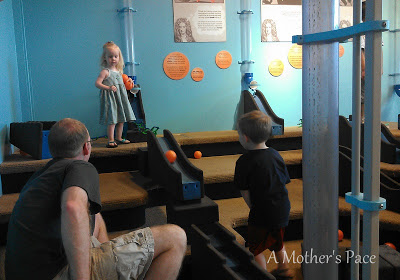
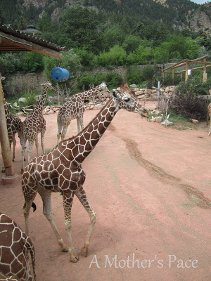
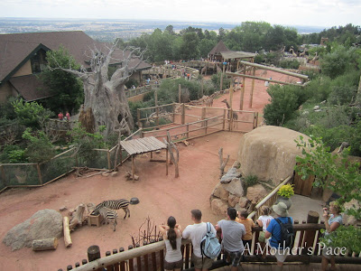
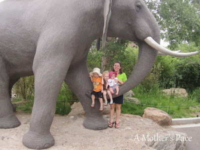

I'm back with more on our vacation to Colorado. In case you missed it you may also find my [running recap](http://bit.ly/135GgKD) and [Take 1](http://bit.ly/135G6mF) of our first two days in Denver.  
  
**Day 3: The Hudson Gardens**  
  
Another day with just the kids and I. This time we headed out to a FREE garden to search for Thomas the Tank Engine. The Hudson Gardens were beautiful and the fact that they had a train and it was free made it perfect for us. (Gotta love a good bargain!)  
  
I spy Thomas!  
  
  

  
My son is perhaps the biggest Thomas the Tank Engine enthusiast. He can hold a conversation about the trains for hours if you let him. When he heard there was a train track to visit it was the one thing he wanted to do on the whole trip. So exciting!  
  
  

  
A water stop during our nice and leisurely day.   
  

  
Little O leads the way.  
  
**Day 4: Denver Children's Museum**  
  
Finally, my husband was off work and could join in the fun with us! We loved the [Magic House Children's Museum](http://bit.ly/14IM2kx) in St. Louis so much that we decided to check out what Denver had to offer. We were not disappointed!  
  
  

  
One of our favorite rooms had an interactive floor. Projectors were set up on the ceiling and (somehow!) made circles on the floor when you touched it. Very cool. The kids danced and had a blast!  
  
  

  
Another one of the rooms where we spent the most time was a kinetic room. The kids and their daddy spent a lot of time building the ramp for the balls while I nursed Little E. The balls shot up one tube, fell down the other and then through the ramp. Also, very cool.   
  
**Day 4: Cheyenne Mountain Zoo**  
  
We left Denver and headed South to Colorado Springs. Little O really wanted to see the mountains since we were in Colorado and we thought this zoo would be the perfect place to make that happen.  
  
  

  
Any time I'm on vacation I love to check out the zoo, especially if I've never been there before. All I can say is the Cheyenne Mountain Zoo is a MUST if you are ever in the area.  
  
  

  
The giraffe exhibit was up close and personal. And they had so many. Our zoo in Wichita has a feeding station but being right up by the giraffes on the entire path was pretty spectacular. They are such beautiful animals.  
  
  

  
One really unique aspect of this zoo is seeing all the animals from above. It was a workout climbing the mountain but so worth it for the views.   
  
  

 

  
I think that we actually saw most of the animals at the zoo but I would definitely visit this zoo again.  
  
  
  

**What is your favorite zoo? I'm always looking for great zoos to add to my bucket list!** 

**Have you ever been to the Hudson Gardens, the Denver Children's Museum or the Cheyenne Mountain Zoo?**

  
  

\-------------------------------------

  

Staying at home with kids sounds easy, right? Life with 3 little ones is busier than I imagined. I don't write every day on the blog but I do update Facebook, Twitter and Instagram more often.   
  
Find A Mother's Pace on...  
  
Twitter [@amotherpace3](https://twitter.com/amotherspace3)  
  
Facebook [http://facebook.com/amotherspace3](http://facebook.com/amotherspace3)   
  
Instagram [amotherspace](http://instagram.com/amotherspace)  
  
RSS [amotherspace](http://feeds.feedburner.com/amotherspace)
