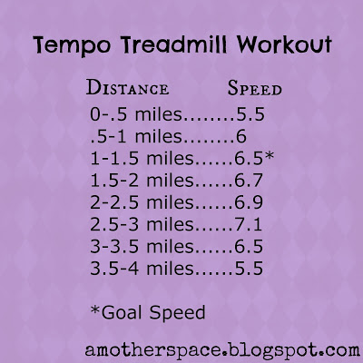
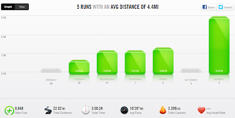

All runners love when everything comes together at the right time to make that perfect run. The conditions are right. Your legs feel good. You feel like you can keep running forever.  
  
Lucky me, my speed work run last week was just that kind of run. It didn't start out that way though.  
  
Friday morning I got out of bed and started to get ready to run. That was when I saw the lightning. Still I was going to head down to the treadmill but that was when my daughter woke up. I had to nurse her so that delayed my run even more.   
  
I probably could have squeezed in a run on the treadmill but I just wasn't feeling it anymore.  
  
Instead I decided to wait until after my husband got off work and run then. This hardly ever works in reality. Dinner, kids and the evening take priority and the run gets pushed back or not done at all.  
  
This night was different. My husband got off work and I headed right downstairs to the treadmill. Dinner could wait just a little longer, right? (Really, while I ran my husband grilled burgers!)   
  
I haven't been on the treadmill in awhile and maybe that had something to do with the fact that it was fun. My goal for the run was a 6.5 speed which puts me at about a 9:14 pace. (Goal pace from the [McMillan Running Calculator](http://bit.ly/130Uelt).)  
  
This is what I ran on a 1% incline.  
  

  
This is my first postpartum tempo run and it ended up being the perfect mix. Tough enough for a great workout but easy enough for someone just getting back into some tempo work.   
  
It's easy to plug in other speeds as well. Just use a pace calculator to figure out what your goal pace should be. Start warming up -1 of your goal pace. Once you reach your goal pace just add .2 each half mile. Then do a cool down in reverse from your warm up.  

  

  
**Weekly Workouts**  
  
Monday:  Rest Day, Core Work  
  
Tuesday: 2 miles Strength and Core Work  
  
Wednesday: 3.5 miles (3 miles plus 6 strides), Core Work  
  
Thursday: 3.51 miles, Core Work  
  
Friday: 4 miles (Tempo), Core Work  
  
Saturday: Rest Day, Core Work  
  
Sunday: 9 miles (long run), Core Work  
  
  

  
Total Running Miles: 22.01  
Weekly Average Pace: 10:28  
  
  

  
August Running Miles: 16.51  
2013 Running Miles: 230.81  

  

**Are you a treadmill runner? Do you like running tempo on the treadmill?**

\------------------------------------------

  

Staying at home with kids sounds easy, right? Life with 3 little ones is busier than I imagined. I don't write every day on the blog but I do update Facebook, Twitter and Instagram more often.   
  
Find A Mother's Pace on...  
  
Twitter [@amotherpace3](https://twitter.com/amotherspace3)  
  
Facebook [http://facebook.com/amotherspace3](http://facebook.com/amotherspace3)   
  
Instagram [amotherspace](http://instagram.com/amotherspace)  
  
RSS [amotherspace](http://feeds.feedburner.com/amotherspace)
