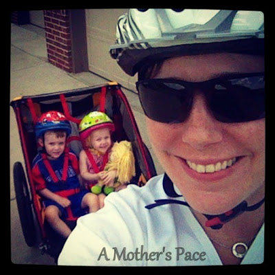
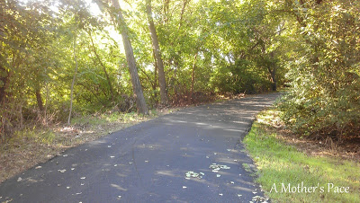
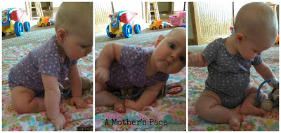
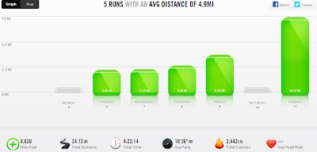
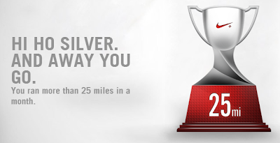

  

 

  

Yes, it finally happened. The sun came out and the rain clouds went away. The humidity went down to the low 70's (which is a big improvement when it's been in the high 90's!) and I was able to enjoy all this while running. In the evening. In August. Amazing!  
  
I was so thankful that I decided to skip my morning run on Friday when I heard the thunderstorm happening. I figured that the treadmill would still be there after work and I could get a little extra sleep. But, surprisingly, by 5:00 in the evening the weather outside was perfect for running and I had one of my most comfortable postpartum runs yet!  
  
Saturday I finally bought a helmet and so I headed out with the kids for a quick spin around our neighborhood. We biked for almost 5 miles and the kids loved it. It's been too long since we've been out together.   
  
  

  
Little O was quite a talker during the ride too. At one point. He said, "This bike is like a race car!" Yep, 3 year olds are fun! HaHa!  
  
Sunday was my long run day. I'm finally in double digits again. 10 miles was fun except for the part that I missed a few spots when I applied body glide. It was so humid here that, OUCH, it made the chaffing pretty bad.   
  
10 miles means that I made it all the way to the park and got to run around inside the park a little before heading home on my out and back.  
  
  

  
This path almost looks like fall already.   
  
Little E is now five months and a few weeks old.   
  
  

  
It's SUCH a fun month. There are so many milestones happening. Two bottom teeth came in this week. She says "Mamamama" and she is almost sitting up all by herself.  
  
  

  
All in one week! She's been busy.  
  
  
  

  
**Weekly Workouts**  
  
Monday:  Rest Day, Core Work  
  
Tuesday: 3 miles  
  
Wednesday: 3.12 miles, Core Work  
  
Thursday: 3.59 miles, Core Work  
  
Friday: 5 miles, Core Work  
  
Saturday: Bike 4.86 miles, Core Work  
  
Sunday: 10 miles (long run), Core Work  
  
  
  

  
Total Running Miles: 24.72  
Weekly Average Pace: 10:36  
  
  

  
August Running Miles: 41.23  
2013 Running Miles: 255.53  
  
Oh, and I can't leave without wishing my husband a happy birthday. He's a fabulous husband, a wonderful daddy, a hard worker and a newbie runner. I couldn't have asked for a better partner in life and I consider myself blessed to be by his side every day. Yikes, I'm getting mushy...better go. :)  

  

**Do you cross train? If so, do you do something fun like biking or are you more serious and 'cycle?'**

  

Updated: I'm linking up for Fitness Friday over at [Jill Conyer's blog](http://jillconyers.com/) and [Running Bloggers](http://runningbloggers.com/fitness-friday-linkup-5/). Come on over and check out all the fitness posts.

  

\------------------------------------------

  

Staying at home with kids sounds easy, right? Life with 3 little ones is busier than I imagined. I don't write every day on the blog but I do update Facebook, Twitter and Instagram more often.   
  
Find A Mother's Pace on...  
  
Twitter [@amotherspace3](https://twitter.com/amotherspace3)  
  
Facebook [amotherspace3](http://facebook.com/amotherspace3)  
  
Instagram [amotherspace](http://instagram.com/amotherspace)  
  
Pinterest [amotherspace](http://pinterest.com/amotherspace/)  
  
Bloglovin' [A Mother's Pace](http://www.bloglovin.com/en/blog/6680087)  
  
RSS [amotherspace](http://feeds.feedburner.com/amotherspace)
