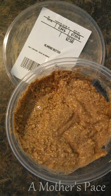
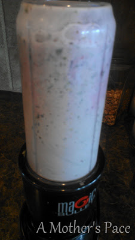
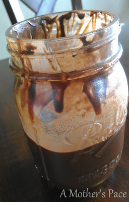
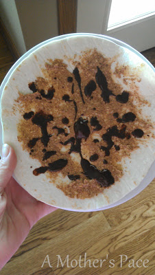
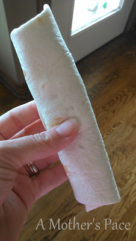
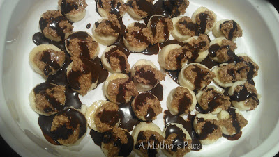

  

It's WIAW and I'm linking up with [Peas and Crayons](http://bit.ly/19hJr6z) to bring you some healthy snacks this week.

  

Almond butter has been making an appearance around here a lot lately.

  

  

My husband does most of the grocery shopping. (He doesn't mind it, I really dislike it...so he goes to the store!) He stumbled upon the almond butter machine a couple of weeks ago. You just pour some almonds in, hit the button and out comes some delicious almond butter. YUM!

  

  
Our local grocery store also started carrying this Stone Hearth Rustic bread from the Delano Bread Co. One of the hardest items to find with 'real' ingredients is bread so my husband always picks up a loaf of this when it is available. Look at those ingredients! Now, if only it were organic! It is a fantastic pre (or post) run snack toasted with a little almond butter on top.  
  
  

  
Usually my kids love to snack on a healthy smoothie too. Last time I think I put a little too much kale in it and it was a little chewy for their tastes though! This smoothie has organic yogurt, kale, frozen grapes, strawberries, blueberries and a splash of orange juice in it.   
  
Chocolate milk is a favorite in our house and we're not buying any more processed chocolate mix to go in it. I found an excellent recipe for chocolate sauce [here](http://bit.ly/15AKGJh) and, turns out, it makes a huge, delicious batch!   
  
  

  
  

  
In my quest to use up our homemade chocolate sauce (tough job, I know!) I had the brilliant idea to spread almond butter on a tortilla and then drip the chocolate on it.   
  

  
It was pretty fantastic! I need to figure out a healthier option for tortillas. We've made them from scratch in the past and I need to start doing that again.  

  

  
And last but definitely not least, my favorite frozen banana snacks. Just cut up a banana, spread almond butter on each banana and then drizzle with chocolate. I usually don't put chocolate on these (and they are amazing without it!!) but remember I'm trying to use up that syrup!   
  
  

**What are your favorite healthy snacks this week?**

  

  

\------------------------------------------

  

Staying at home with kids sounds easy, right? Life with 3 little ones is busier than I imagined. I don't write every day on the blog but I do update Facebook, Twitter and Instagram more often.   
  
Find A Mother's Pace on...  
  
Twitter [@amotherspace3](https://twitter.com/amotherspace3)  
  
Facebook [amotherspace3](http://facebook.com/amotherspace3)  
  
Instagram [amotherspace](http://instagram.com/amotherspace)  
  
Pinterest [amotherspace](http://pinterest.com/amotherspace/)  
  
Bloglovin' [A Mother's Pace](http://www.bloglovin.com/en/blog/6680087)  
  
RSS [amotherspace](http://feeds.feedburner.com/amotherspace)
