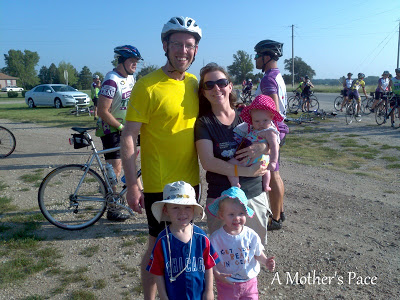
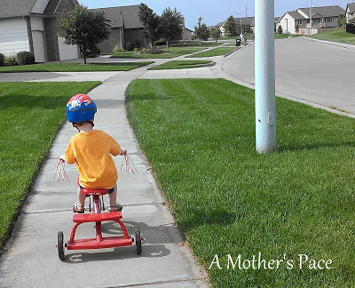
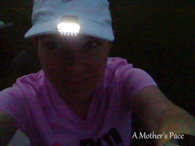
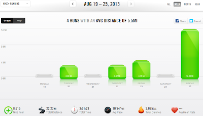

Saturday was [Pedalfest](http://bit.ly/12z8sIG) here in Wichita. My husband rode the 50K with his dad, uncle and brother-in-law, along with a lot of friends.  
  
  

  
The kids, Nana and I cheered on the riders at two SAG stops along the way. It's such a fun event and is getting larger every year. Pedalfest is celebrating it's 10th anniversary but this is the 3rd year my husband has participated.   
  
My oldest is also loving his 'bike' right now. He just recently really learned how to pedal all on his own and I just love watching him go. We've been going on a lot of walks around the neighborhood.  
  
  

  
Fall is coming and so are the darker mornings. Because my husband and I are both running in the morning before he goes to work I am not running as early as I used to. (He runs first and then I head out after he gets back.) By the time I leave around 6:30 the sun is starting to come up but I've had to use my **[light](http://amzn.to/17WSdVK)** a little bit this past week.  
  
  

  
Can't believe that my first half marathon of the fall is in just 3 weeks! I'm getting nervous excited already.   
  
My long run yesterday was 12 miles. 12 miles [**without a watch**](http://bit.ly/15aJ4wG). Ugh! And on top of that my Nike+ app on my phone was not set up to tell me the pace every mile. So I was running completely naked with no feedback for over 2 hours.   
  
That made it a tough run mentally. It also was a tough run physically. I didn't make it out of the house as early as I wanted so it was getting pretty warm and the humidity was high. It was one of those runs where I wonder why am I doing this??? At least I know a good run is right around the corner and I can look forward to that.  
  
  

  
**Weekly Workouts**  
  
Monday:  Rest Day  
  
Tuesday: 3 miles  
  
Wednesday: Unexpected Rest Day  
  
Thursday: 3 miles, Core Work  
  
Friday: 4.15 miles (Speed Work)  
  
Saturday: Rest Day  
  
Sunday: 12 miles (long run)  
  
  

  
  
  
  
Total Running Miles: 22.24  
Weekly Average Pace: 10:24  
  
August Running Miles: 89.48  
2013 Running Miles: 279.06  
  
  
  

**How were your workouts last week? Are you training for a race right now?**

  
  
  
I've linked up with Jen over at [Marathon Mom](http://www.runnershoe.blogspot.com/2013/08/marathon-decisions.html) today.  
  
  

\------------------------------------------

  

Staying at home with kids sounds easy, right? Life with 3 little ones is busier than I imagined. I don't write every day on the blog but I do update Facebook, Twitter and Instagram more often.   
  
Find A Mother's Pace on...  
  
Twitter [@amotherspace3](https://twitter.com/amotherspace3)  
  
Facebook [amotherspace3](http://facebook.com/amotherspace3)  
  
Instagram [amotherspace](http://instagram.com/amotherspace)  
  
Pinterest [amotherspace](http://pinterest.com/amotherspace/)  
  
Bloglovin' [A Mother's Pace](http://www.bloglovin.com/en/blog/6680087)  
  
RSS [amotherspace](http://feeds.feedburner.com/amotherspace)
