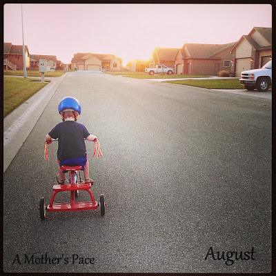
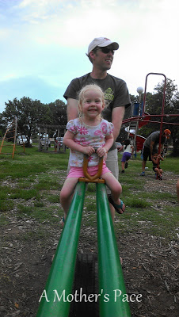
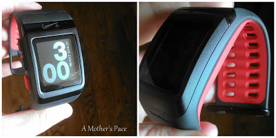
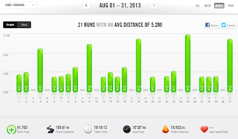
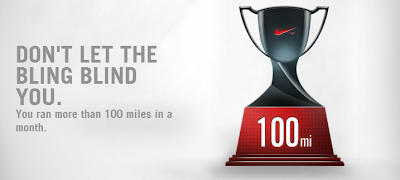

  
  
A Sunday post!?! Yes, it's the beginning of a new month and I like to wrap things up and then start the new month off fresh. So a Sunday post it is! My August in Review post is today and my regular weekly training update post will go out tomorrow.  
  
**Mothering Moments**  
My favorite new thing about Little O (who turns 4 in September) is watching him ride on his tricycle. He LOVES it and I look forward to our neighborhood walks with the trike maybe as much as he does.  
  

  
Little A is potty training right now (She'll turn 3 in November) and she lives in just her underwear. Completely her choice, she just likes to hang out with no clothes. I'm fine with it because it means less laundry (and stains...she is a messy eater!!) and she always puts on clothes just fine when we leave the house.   
  

  
You'll have to make due with a random fully clothed picture of her. :) One of the hard things about her always being in underwear is that it makes taking and sharing pictures hard. Like the other day when she got out my foam roller with the directions and started rolling out her belly, legs and rear. So cute and, of course, all in her underwear!  
  
Little E is at such a fun baby stage. (She's 6 months old.) Sitting up, chatting with all her baby sounds, just starting solid food and so much more. Fun, fun fun!  

  

**Racing/Training in July**  
  
No racing to report in August but I'm getting very close to my September race. I'm right at the peak of my mileage before taper starts next week.  
**Challenges**  
  
I participated in the #AugustCoreFocus challenge this month and started off great. I love the idea of the challenge but for some reason couldn't make myself stick with it this month. Core work is important to me as well as general strength training but I think the thing that makes it most difficult is that lately my kids are not napping really well.   
  
**A Few of my Favorites from A Mother's Pace**  
  
  
[**5 Minutes a Day**](http://amotherspace.blogspot.com/2013/08/5-minutes-day.html#.UiDu6ZJQGgQ)  
  
Go figure that one of my most popular posts was about the #AugustCoreFocus challenge! I really like how some people took this idea and commented how they wanted to try it out with other areas of their life. It's changed how I think about cleaning my house as well!  
  
[**Running Long on the Treadmill**](http://amotherspace.blogspot.com/2013/08/running-long-on-treadmill.html#.UiDu95JQGgQ)  
  
August was not a typical month weather-wise. We had a ton of rain and storms so I ran on the treadmill more than usual. I believe I have learned to love my treadmill.   
  
**[Running Double Digits](http://amotherspace.blogspot.com/2013/08/running-double-digits.html#.UiDu-pJQGgQ)**  
  
This month I finally reached my first postpartum double digits! I'd missed running long throughout my pregnancy and recovery and I'm glad to be back at it.  

  
**[Running without a Watch](http://amotherspace.blogspot.com/2013/08/running-without-watch.html#.UiDvDpJQGgQ)**  
  
Another popular post this month. I had some watch problems and was forced to run without my watch for several runs. It wasn't quite as hard as I thought it was going to be but I'm glad to have a watch back.  
  
**Favorite Running Gear**  
Yes, I have a new watch. And I'll write more about it later but my favorite running gear this month would have to be my new [Nike+ sport watch](http://amzn.to/12Yrubz). I love it and I can't say enough about Nike's customer service department.   
  

  
**Workouts in July**  
  
  

  
  
Total Running Miles: 109.61  
Treadmill Miles: 27  
Stroller Miles: 0  
Average Pace: 10:30  
  
Total Running Miles for 2013: 299.16  
  

   

It's been awhile since I passed 100 miles in a month! It feels good to be running some high mileage again.

  

**How was your August? Did you hit any mileage goals? What fun things are your kids doing lately?**

\------------------------------------------

  

Staying at home with kids sounds easy, right? Life with 3 little ones is busier than I imagined. I don't write every day on the blog but I do update Facebook, Twitter and Instagram more often.   
  
Find A Mother's Pace on...  
  
Twitter [@amotherspace3](https://twitter.com/amotherspace3)  
  
Facebook [amotherspace3](http://facebook.com/amotherspace3)  
  
Instagram [amotherspace](http://instagram.com/amotherspace)  
  
Pinterest [amotherspace](http://pinterest.com/amotherspace/)  
  
Bloglovin' [A Mother's Pace](http://www.bloglovin.com/en/blog/6680087)  
  
RSS [amotherspace](http://feeds.feedburner.com/amotherspace)
