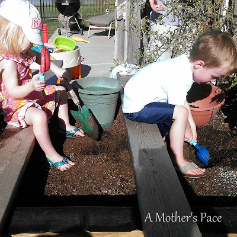
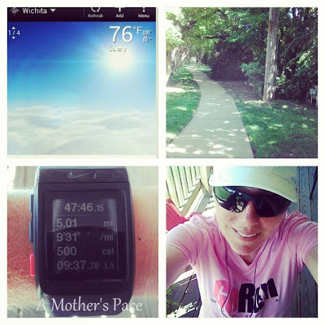

Labor Day started out with sleeping in. I woke up and saw that it was 63 degrees outside and thought about running but I decided to have family time instead. We had a bit of a lazy morning with pancakes, eggs and coffee. 

  

We also got started on our fall garden. The kids dug holes to help put our watering system in. 

  

  

It warmed up to the mid 70's pretty quickly but I still decided that a run outside would be much better than on the treadmill. I just planned a shady route and so the strong sun didn't bother me very much.

  

  

I kicked off my [5 and 10 Virtual Race Series](http://www.mommyrunfast.com/virtual-run-series/fall-5-and10-registration/) yesterday with a fun 5 miles. It was one of those runs where I had a silly smile on my face throughout the run and completely felt that Runner's High after I was finished.  

  

  

It was a fast run for me at my postpartum stage right now. One of my quickest and longest that was not on the treadmill. Going quicker on the treadmill is a lot easier for me so the fact that I was able to hold this pace for 5 miles gave me a lot of confidence. Confidence that I WILL be able to accomplish goals during my fall races. 

  

It's exactly what I need right now in my training. I need to know that I can run under a 10 minute mile for a longer distance. One of the best things about this run? I could have kept going. It didn't wipe me out and I wasn't wasted by the end of it. Even if I don't have another great run before my race I know that I ran these 5 miles and that will give me the CONFIDENCE that I need on race day.

  

  

I didn't have a negative split but my first mile was the slowest. That's something that I've been working on but it doesn't always happen. 

  

This one definitely goes down as a #BestRun in my book.

  

Distance: 5 miles

Time: 47:46

Average Pace: 9:31

  

**Tell me about your most recent best run.**

  
Edited to add: Linking up with Running Blogger's [Fitness Friday](http://runningbloggers.com/fitness-friday-linkup-8/).  
  
  

\------------------------------------------

  

Staying at home with kids sounds easy, right? Life with 3 little ones is busier than I imagined. I don't write every day on the blog but I do update Facebook, Twitter and Instagram more often.   
  
Find A Mother's Pace on...  
  
Twitter [@amotherspace3](https://twitter.com/amotherspace3)  
  
Facebook [amotherspace3](http://facebook.com/amotherspace3)  
  
Instagram [amotherspace](http://instagram.com/amotherspace)  
  
Pinterest [amotherspace](http://pinterest.com/amotherspace/)  
  
Bloglovin' [A Mother's Pace](http://www.bloglovin.com/en/blog/6680087)  
  
RSS [amotherspace](http://feeds.feedburner.com/amotherspace)
