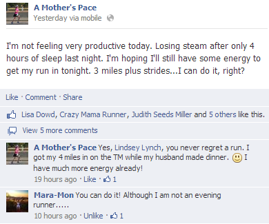
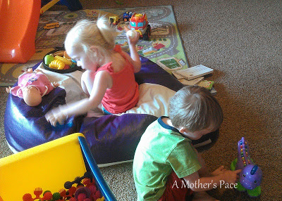
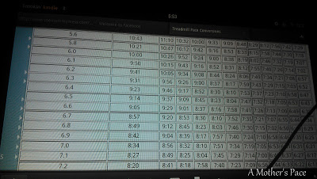
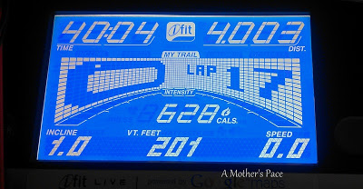
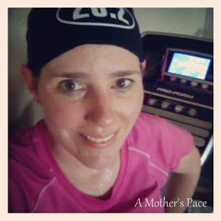
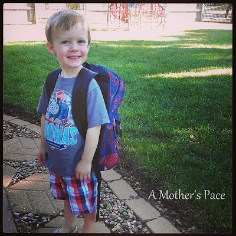

One of the best things to come out of blogging is support from other people.   
  
I was having a low motivation day and decided to post something on [facebook](https://www.facebook.com/amotherspace3).  
  
  

  
It definitely helped motivate me when I heard encouraging words from other people.   
  
I hopped on the treadmill and ended up having a great run that made me feel like I had even more energy. Although I will admit that it quickly faded after dinner and a glass of wine. I almost fell asleep reading a book to the kids at bedtime!  
  
I had 3 miles easy plus strides on my training plan. The kids and I went downstairs. They played.  
  
  

  
And I ran. I used my [treadmill pace conversion chart](http://bit.ly/15Cu6zK) again to help me figure out the speed I wanted to run.   
  
  

  
I started out at 5.6 (10:43 pace) and added .1 every half mile. By the end of my 3 miles I was running at 6.1 (9:50 pace).   
  
Then the strides started. Mentally I told my self that I can do this. I wanted my strides to be at 7.0 (8:34 pace) which is very fast for me. It was tough but I kept telling myself that I can do it. Believe. And, it worked. I did 5 .10 strides with recovery for .10 at 6.0 speed in between.  
  
  

  
4 miles in 40 minutes. Not bad for an 'easy' run.   
  
And afterwards I felt great! A big thank you to everyone who took a second to throw a little encouragement my way. It really worked!  
  
  

  
School started for this little guy this week. He is doing great and loving every minute of it.   
  
  

  
I'm adjusting to having only 2 kids at home and even taking advantage of it. Thursday we dropped Little O off at school and then headed to the park.   
  
It was my first time with two kids in the jogging stroller and we all had fun. I'm so glad that it is cool enough in the morning to get out and enjoy a run together.  
  
  

  
3 miles at a 10:40 pace with about 50+ extra pounds. I'm hoping to make this a regular thing for the girls and I.  
  
  
  

**Does social media ever motivate you to exercise? Do you run with a jogging stroller?**

  
  
Today I'm linking up with Jill Conyers for [Fitness Friday](http://jillconyers.com/2013/09/different-types-of-protein-powders/).  

\------------------------------------------

  

Staying at home with kids sounds easy, right? Life with 3 little ones is busier than I imagined. I don't write every day on the blog but I do update Facebook, Twitter and Instagram more often.   
  
Find A Mother's Pace on...  
  
Twitter [@amotherspace3](https://twitter.com/amotherspace3)  
  
Facebook [amotherspace3](http://facebook.com/amotherspace3)  
  
Instagram [amotherspace](http://instagram.com/amotherspace)  
  
Pinterest [amotherspace](http://pinterest.com/amotherspace/)  
  
Bloglovin' [A Mother's Pace](http://www.bloglovin.com/en/blog/6680087)  
  
RSS [amotherspace](http://feeds.feedburner.com/amotherspace)
