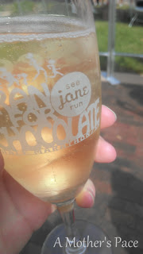

As much as I wanted to get a race recap from my See Jane Run half marathon over the weekend out today, it didn't happen. Look for it tomorrow! I will say that the course was beautiful and running was fun. _And_ there was chocolate and champagne at the finish. Can't beat a finish like that!  
  
  

  
My last week in training was not the best. I completed all the miles on my training plan but I had some unexpected ankle pain. I don't remember hurting it and it could have been a million things but I was not happy that it was hurting. In fact, even when I woke up on Saturday I wasn't sure how I would be feeling on race day.   
  
Luckily for me though, I woke up to no pain and it hasn't hurt since. Weird. Made up mental taper pain???  
  
  
  

  
**Weekly Workouts**  
  
Monday:  Strength: Upper Body Sworkit  
  
Tuesday: 2 miles, Strength: Lower Body Sworkit, Abs  
  
Wednesday: 2 miles  
  
Thursday: Rest Day  
  
Friday: Rest Day  
  
Saturday: RACE DAY!  
  
Sunday: Rest Day  
  
That's a bunch of rest days! My graph looks so empty this week.   
  
  

  
Total Running Miles: 17.14  
Weekly Average Pace: 10:04  
  
September Running Miles: 42.17  
2013 Running Miles: 341.33  
  
  
  

**Did you race this weekend? How did it go?**

  
  
Today I'm linking up with Jen over at [Marathon Mom](http://runnershoe.blogspot.com/2013/09/marathon-weekly.html).  
  
  

\------------------------------------------

  

Staying at home with kids sounds easy, right? Life with 3 little ones is busier than I imagined. I don't write every day on the blog but I do update Facebook, Twitter and Instagram more often.   
  
Find A Mother's Pace on...  
  
Twitter [@amotherspace3](https://twitter.com/amotherspace3)  
  
Facebook [amotherspace3](http://facebook.com/amotherspace3)  
  
Instagram [amotherspace](http://instagram.com/amotherspace)  
  
Pinterest [amotherspace](http://pinterest.com/amotherspace/)  
  
Bloglovin' [A Mother's Pace](http://www.bloglovin.com/en/blog/6680087)  
  
RSS [amotherspace](http://feeds.feedburner.com/amotherspace)
