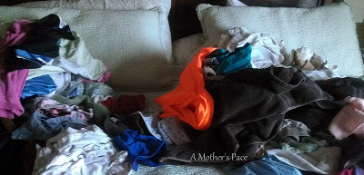
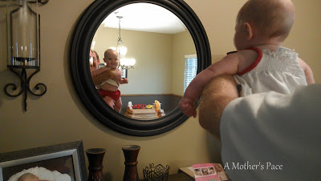
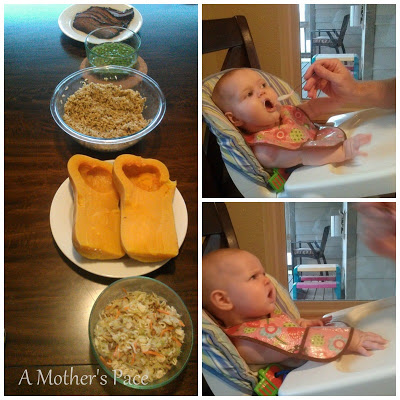
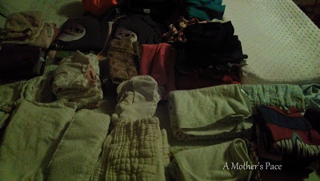
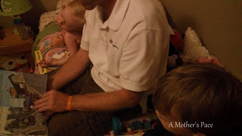

  

  
Monday, September 16, 2013  
  
6 a.m. An alarm went off. It wasn't mine but I was wide awake so I got up a half an hour early.   
  
Started to get ready for the day.   
  
6:30 a.m. Little A and Little O woke up and started to play in the playroom.   
  
7 a.m. Little E woke up. I nursed her. My husband fixed breakfast for the older two. We continued to get ready to head out.  
  
  

  
I ate my favorite homemade granola and organic vanilla yogurt with a cup of coffee for breakfast.  
  

  
9:00 a.m. Move and Groove class. It's the first one of the school year and my kiddos are so excited! All 3 had a blast. It was fun to see Little E play with all the instruments, bean bags and scarves for the first time.  
  
10:00 a.m. Home again. Trying to squeeze in diaper changes and folding laundry before company comes over.  
  
  

  
I usually throw the loads of laundry on my bed and then try to fold it throughout the day. That way we have to fold it before getting in bed at night! Laundry today is a load of darks, towels and diapers later on.  
  
  

  
10:30 a.m. Play date at our house. Our cousins brought over Jack the horse. Yeehaw!  
  
11:30 a.m. My husband comes up for lunch. He works at home in the basement so we're pretty lucky to have him here during lunchtime. I swear I wouldn't get to eat if I didn't have his help making the food. Blogger fail though...I forgot to take a picture of our lunch!  
  
A quick selfie. This is what I look like today.  
  
  

  
1:00 p.m. Nap time! Little E fell asleep first. I sat on the floor in the bedroom while the older two fell asleep. It works best if I'm in there with them. Otherwise they keep each other awake. All 3 slept today!! At the same time!! That doesn't happen a lot lately.  
  
  

  
1:30 p.m. Blog time. Working on my [**See Jane Run Half Marathon Recap**](http://bit.ly/16C2CId).  
  
3:00 p.m. Little A woke up first. Followed quickly by Little O and Little E. Nurse, change diapers and some playtime.   
  
  

  
Cloth diapers have been the best investment for us. Most of them have lasted through all three children. They've more than paid for themselves already.  
  
4:30 p.m. Dinosaur Train on Netflix while I foam roll (I'm sore after my half marathon on Saturday!!) and Kara Goucher's Nike Training Club Stretching Routine. Little E plays with toys while I'm stretching.  
  
  

  
5:00 p.m. Throw a butternut squash in the oven for dinner and head out for a walk to the mail box. It's a beautiful 75 degrees out this afternoon!  
  
  

  
5:30 p.m. Put a load of diapers in the wash and play time until dinner.  
  
  

  
Daddy comes up for the night. Little E is happy to see him!  
  
6:30 p.m. Dinner. Quick, easy and delicious. My husband warmed everything up and we all sat down to eat. Leftover Smoked brisket, peas, pesto and brown rice, butternut squash and sunflower crunch salad.   
  
  

  
We introduced butternut squash to Little E tonight. She loves her cereal (top picture) but wasn't quite so sure of the squash (bottom picture).   
  
7:00 p.m. Start to get Little E ready for bed. Nurse her, snuggle for a bit. Lay her down. Fold and put away more laundry.  
  
  

  
It's a dark photo because my 6 month old is asleep in the same room. She still sleeps in her bassinet.   
  
8:00 p.m. Story time and rub Little O and Little A's back while they fall asleep.  
  
  

  
8:40 p.m. Time on the computer. Change diaper load. Getting ready for bed.  
  
  

  
10:00 Bedtime!  
  
Not included: many diaper changes, 2 potty accident clean ups and several nursing times throughout the day.  
  
I'll leave you with one of the best selfies ever. I caught him doing this today and I don't even take that many selfies at all! So funny!  
  
  

  
  
  

**What did you do on Monday?**

  
  
Today I'm linking up with [**Jill**](http://jillconyers.com/2013/09/a-day-in-the-life/) and [**Angela**](http://www.happyfitmama.com/a-day-in-the-life/) for **A Day In the Life** and **[Jenn](http://www.peasandcrayons.com/2013/09/what-i-ate-wednesday-139.html)** for **WIAW**.   
  
  
  
  

\------------------------------------------

  

Staying at home with kids sounds easy, right? Life with 3 little ones is busier than I imagined. I don't write every day on the blog but I do update Facebook, Twitter and Instagram more often.   
  
Find A Mother's Pace on...  
  
Twitter [@amotherspace3](https://twitter.com/amotherspace3)  
  
Facebook [amotherspace3](http://facebook.com/amotherspace3)  
  
Instagram [amotherspace](http://instagram.com/amotherspace)  
  
Pinterest [amotherspace](http://pinterest.com/amotherspace/)  
  
Bloglovin' [A Mother's Pace](http://www.bloglovin.com/en/blog/6680087)  
  
RSS [amotherspace](http://feeds.feedburner.com/amotherspace)
