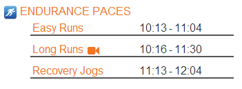
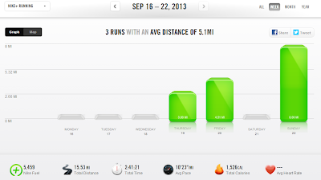

Last week was all about recovery from my [**half marathon**](http://bit.ly/1aUsWOQ) on Saturday. I took the beginning of the week off and then the first couple of runs back were at an easy pace. By Saturday I was ready to get back to work because I have another half coming up and I only have 3 short weeks to train for it.  
  
I did so much better (postpartum) than I had anticipated with my recent half marathon which made me motivated to do even better at the next one. Better, meaning that 2:04:33 is my current PR and I would love to beat that time. I'm not sure if it is asking too much to bring my time down by 5 minutes in such a short amount of time but I'm going for it.  
  
So I visited the [McMillan Running Calculator](http://bit.ly/130Uelt) site and plugged in my recent numbers. A 2:03 half marathon pace is 9:23. 
  
9:23. 
  
It's going to be tough but I know I can do all the training paces so it will just mean beating the mental challenges on race day.  
  
  

  
My plan is to stick to the lower pace in the ranges from McMillan shown above and to work on being positive during my running. Mental toughness!  
  
Also, I'll have a couple of speed work sessions which will include mile repeats at an 8:45-9:01 pace.  
  
The next couple of weeks will be challenging but I'm looking forward to it!  
  
  
  

  
**Weekly Workouts**  
  
Monday:  Rest Day, NTC KG's Pro Stretches  
  
Tuesday: Rest Day, NTC Sculpted Arms  
  
Wednesday: Rest Day, NTC Ab Burner  
  
Thursday: 3 miles  
  
Friday: 4.51 miles, NTC Leaner Legs  
  
Saturday: Rest Day  
  
Sunday: 8 miles (long)  
  
  

  
Total Running Miles: 15.51  
Weekly Average Pace: 10:23  
  
September Running Miles: 57.68  
2013 Running Miles: 356.84  
  
  
  

**How were your workouts last week? Do you jump right back in with running after a race or take a little break?**

  
I've linked up with Jen over at [Marathon Mom](http://www.runnershoe.blogspot.com/2013/09/marathon-weekly_23.html) today.  
  
  

\------------------------------------------

  

Staying at home with kids sounds easy, right? Life with 3 little ones is busier than I imagined. I don't write every day on the blog but I do update Facebook, Twitter and Instagram more often.   
  
Find A Mother's Pace on...  
  
Twitter [@amotherspace3](https://twitter.com/amotherspace3)  
  
Facebook [amotherspace3](http://facebook.com/amotherspace3)  
  
Instagram [amotherspace](http://instagram.com/amotherspace)  
  
Pinterest [amotherspace](http://pinterest.com/amotherspace/)  
  
Bloglovin' [A Mother's Pace](http://www.bloglovin.com/en/blog/6680087)  
  
RSS [amotherspace](http://feeds.feedburner.com/amotherspace)
