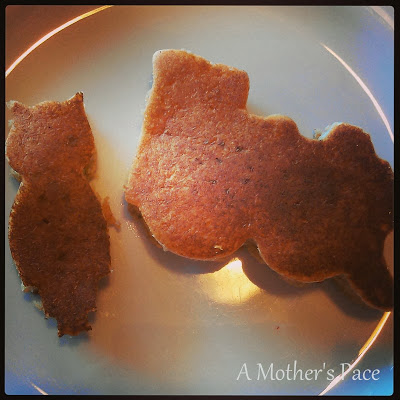
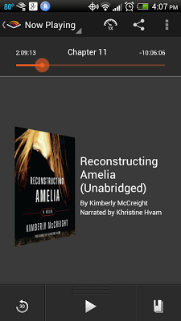
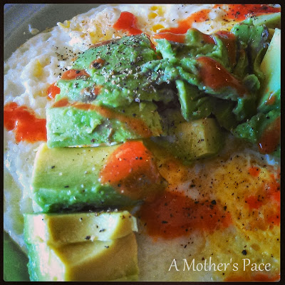

When I woke up on Sunday it was a beautiful 52 degrees. While I was very excited to have the opportunity to run in that temperature I was even more excited to spend some time with my family on a weekend morning. I opted to stay home and have a relaxing morning.  
  
My husband made pancakes.   
  
  

  
For the owl and train lovers of the household.  These whole wheat pancakes are our favorite recipe, delicious!  
  
Of course pancakes are not the best pre long run fuel. I had to nurse Little E before heading out anyway so I waited for her next feeding time. She ended up taking a huge nap in the morning and by the time I was ready to get out and run it was already 12:45. So much for my late morning run I had planned!  
  
It was still only 75 degrees out so not unbearable. Just not as nice as it would have been early in the morning.   
  
  

  
It was sunny and there was a little breeze which made for a nice run. I had 8 miles on the schedule and it went by very quickly. My goal pace was between 10:16 and 11:30. I'm trying to stay at the lower end of all my [**pace goals**](http://amotherspace.blogspot.com/2013/09/whats-next.html#.UkA6MoZQEYk) to prepare for my upcoming half marathon. This run was right on target.   
  
Distance: 8 miles  
Time: 1:22:32  
Average Pace: 10:18   
  

  
I started listening to "[**Reconstructing Amelia**](http://amzn.to/16u4qPj)" by Kimberly McCreight. It's my next book club book and with only a week to read it I figured that I better get the audio version plus the kindle version. With Whispersync I can go back and forth between the two. I love that feature. It's a good book so far too. I finished 8 chapters during my run and then I'm still able to read before bedtime or while nursing Little E. It's 12 hours long so I know I won't be able to listen to the whole book while running before Monday. I also like to read a little before bedtime so having both versions is working out perfectly.   
  
Finally, I've discovered the best post run meal. Even better because it was made by my husband.  
  
  

  
Fried eggs, avocado, hot sauce, salt, pepper and a side of toast. It doesn't matter what time of day it is....this is my favorite after running. Just looking at this photo is making me hungry again.  
  
  
  

\------------------------------------------

  

Staying at home with kids sounds easy, right? Life with 3 little ones is busier than I imagined. I don't write every day on the blog but I do update Facebook, Twitter and Instagram more often.   
  
Find A Mother's Pace on...  
  
Twitter [@amotherspace3](https://twitter.com/amotherspace3)  
  
Facebook [amotherspace3](http://facebook.com/amotherspace3)  
  
Instagram [amotherspace](http://instagram.com/amotherspace)  
  
Pinterest [amotherspace](http://pinterest.com/amotherspace/)  
  
Bloglovin' [A Mother's Pace](http://www.bloglovin.com/en/blog/6680087)  
  
RSS [amotherspace](http://feeds.feedburner.com/amotherspace)
