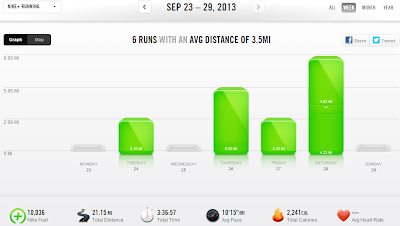

It's been a whirlwind this week. My son turned 4 on Sunday and we had a big party over the weekend.   
  

  
Between getting ready for the party, decorating the cake, getting ready for company and just plain life, there hasn't been much time for anything else. Except running. It takes a lot for me to not fit running in.  
  
I had to adjust my training plan to do my long run on Saturday instead of Sunday. It may not seem like a big thing but I still wanted to get miles in and so I ran a little on Friday too. I usually rest the day before a long run so I just ran the miles easy.  
  
Saturday I woke up to lightning and so it was 10 miles on the treadmill. Or at least almost 10 miles. I ran about 4.5 and then got off to finish the run outside. I was sweaty and it was a windy 50ish degrees out so I ran down the street and decided to turn around and finish the run on the treadmill. Brrr. It wouldn't have bothered me if I had started outside but the change in temperature in the middle of a run was too hard for me to handle.   
  
I ended up doing about 9 miles but had to stop because of chafing. I was in so much pain I just couldn't finish the last mile. But that is a whole other blog post.  
  

  
**Weekly Workouts**  
  
Monday:  Rest Day  
  
Tuesday: 3.1 miles, NTC: Arm Definer  
  
Wednesday: Rest Day  
  
Thursday: 6 miles  
  
Friday: 3.1 miles   
  
Saturday: 8.9 miles   
  
Sunday: Rest  
  
  

  
Total Running Miles: 21.15  
Weekly Average Pace: 10:15  
  
September Running Miles: 78.78   
2013 Running Miles: 377.94  
  
  
  

**Do you like to take a rest day before or after a long run? Or both?**

  
  
  

\------------------------------------------

  

Staying at home with kids sounds easy, right? Life with 3 little ones is busier than I imagined. I don't write every day on the blog but I do update Facebook, Twitter and Instagram more often.   
  
Find A Mother's Pace on...  
  
Twitter [@amotherspace3](https://twitter.com/amotherspace3)  
  
Facebook [amotherspace3](http://facebook.com/amotherspace3)  
  
Instagram [amotherspace](http://instagram.com/amotherspace)  
  
Pinterest [amotherspace](http://pinterest.com/amotherspace/)  
  
Bloglovin' [A Mother's Pace](http://www.bloglovin.com/en/blog/6680087)  
  
RSS [amotherspace](http://feeds.feedburner.com/amotherspace)
