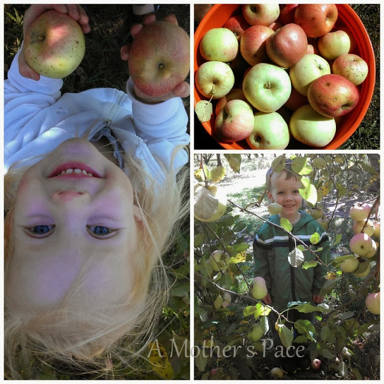

  
It's finally feeling a bit more like fall around here lately. This past weekend we took advantage of it and took a trip to the apple orchard.   
  
It's my first time at an orchard (that I remember) but it won't be my last! I'd love for this to be an annual fall visit.  
  
  

  
All three of the kids really had a ball picking the apples and eating them right off of the tree. At least the two older ones enjoyed actually eating them.   
  
  

  
We picked a half bushel all together. I'm looking forward to making applesauce and apple crisp first.  
  
I'm guessing that will use up all the apples because we're enjoying them just plain too.  
  

  
When we were finished picking we stopped by the shop for a few apple slushies. Yum, they were refreshing and delicious!  
  
  

  
Nana and Papa's house is always fun. You know it's been a great weekend when the kids are asleep within minutes on the drive home.  
  
  

  
**Weekly Workouts**  
  
Monday:  Rest Day  
  
Tuesday: 5 miles ([5 and 10 Mile Virtual Race Series](http://amotherspace.blogspot.com/2013/10/octobers-fall-5-and-10-virtual-race.html#.UlIU-SRQEYk))  
  
Wednesday: 3.1 miles (easy)  
  
Thursday: 4.01 miles (speed work)  
  
Friday: Rest Day  
  
Saturday: 8 miles (last 'long' run before half)  
  
Sunday: Rest Day  
  
  

  
Total Running Miles: 20.12  
Weekly Average Pace: 9:52  
  
October Running Miles: 20.11  
2013 Running Miles: 398.05  
  
  
  

**Have you been to an apple orchard before? What other fall activities do you like to do?**

  
I've linked up with Jen over at [Marathon Mom](http://www.runnershoe.blogspot.com/2013/10/a-race-and-maybe-im-backmarathon-monday.html) today.  
  
  

\------------------------------------------

  

Staying at home with kids sounds easy, right? Life with 3 little ones is busier than I imagined. I don't write every day on the blog but I do update Facebook, Twitter and Instagram more often.   
  
Find A Mother's Pace on...  
  
Twitter [@amotherspace3](https://twitter.com/amotherspace3)  
  
Facebook [amotherspace3](http://facebook.com/amotherspace3)  
  
Instagram [amotherspace](http://instagram.com/amotherspace)  
  
Pinterest [amotherspace](http://pinterest.com/amotherspace/)  
  
Bloglovin' [A Mother's Pace](http://www.bloglovin.com/en/blog/6680087)  
  
RSS [amotherspace](http://feeds.feedburner.com/amotherspace)
