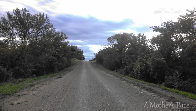
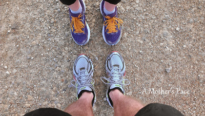
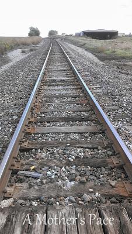
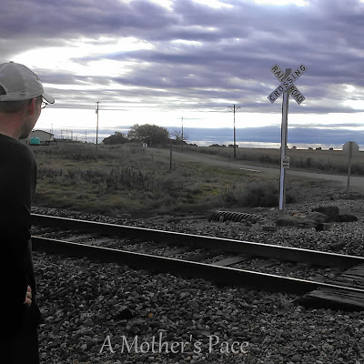
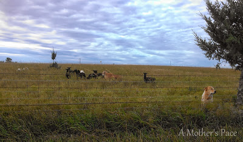
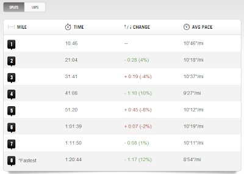

Over the weekend we were away at Nana and Papa's house. Not only did we **[pick apples at a local orchard](http://amotherspace.blogspot.com/2013/10/apple-picking.html#.UlMMtSRQEYk)** but we got a run in over the weekend as well. They live out in the country and are surrounded by gravel roads.

  

Originally we wanted to drive in to town to run on pavement but we realized that we didn't have that much time to drive in, run and then drive back out. Gravel it was. 

  

I was a little nervous to run on the gravel the week before a race but it ended up being a nice change of pace and a softer running surface. No turned ankles so all was well!

  

Ever since my **[half marathon](http://amotherspace.blogspot.com/2013/09/see-jane-run-half-marathon-wichita-race.html)** a couple of weeks ago I have really been trying to pay attention to training paces. I feel like I have an accurate race time for the first time postpartum which helps when I plug my race into a pace calculator.

  

My goal for my 8 miles on Saturday was a 10:16 pace at the fastest. My range was 10:16 to 11:30, according to the McMillan Calculator. 

  

  

My husband and I were able to run together since the kids were all with Nana and Papa. 

  

We started out in the chilly fall temps (mid 40's) and ran straight in one direction. Our plan was to run for 2 miles, turn around and return to the house at 4 miles for water. Then head back out and do the same thing in the other direction. 

  

  

  

We ran to the train tracks at slightly over 2 miles and turned around. Right into the wind. I really had no idea that it was that windy out but no wonder the run was feeling as great as it was. It took turning around to realize that the wind was helping to push me along! 

  

That third mile was pretty slow but then we picked it up a little for the fourth. When the mile beeped at the finish my watch read 9:27, whoa, we needed to slow down a bit!

  

  

The fun thing about running in the country is that you really never know what you'll come across. These watch dogs were on the job. As soon as I came closer (to take this picture, ha!) the dogs split up and started leading their sheep away while one dog stayed back to guard the fence and make sure we stayed away. Pretty neat to watch them hard at work.

  

After our water stop we were still running against the wind but looking forward to turning around and running with it again. It was a little hillier than I'm used to but I enjoyed the challenge and the distraction of new scenery. 

  

After we turned around and had only one mile left my husband said something like, only one mile left and it's all down hill. My overall pace was a little too fast at this point but I decided he was right. I felt great and I wanted to run fast. We finished our last mile at an 8:54 pace. That push at the end made me feel exhilarated. Love that runner's high at the end of a great run!

  

  

Distance: 8 miles

Time: 1:20:48

Average Pace: 10:05

  

**What surface do you prefer to run on? Do you like to run on gravel?**

  

\------------------------------------------

  

Staying at home with kids sounds easy, right? Life with 3 little ones is busier than I imagined. I don't write every day on the blog but I do update Facebook, Twitter and Instagram more often.   
  
Find A Mother's Pace on...  
  
Twitter [@amotherspace3](https://twitter.com/amotherspace3)  
  
Facebook [amotherspace3](http://facebook.com/amotherspace3)  
  
Instagram [amotherspace](http://instagram.com/amotherspace)  
  
Pinterest [amotherspace](http://pinterest.com/amotherspace/)  
  
Bloglovin' [A Mother's Pace](http://www.bloglovin.com/en/blog/6680087)  
  
RSS [amotherspace](http://feeds.feedburner.com/amotherspace)
