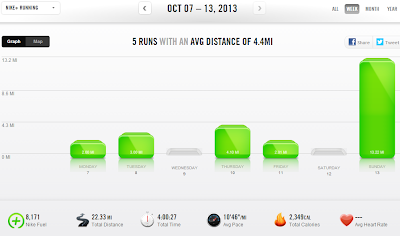

  
My taper last week was pretty active. I merged two plans together and decided to run the higher mileage only if I was feeling it. Apparently I was because I met the high end of all of my runs in the training plan.  
  
I missed my early wake up on Tuesday but decided to run with the girls after dropping my son of at preschool. Boy, is pushing that double stroller in the Kansas wind a challenge!   
  
I had to rig up a blanket mid run to block the wind from the girls on the way home. They were all bundled up inside and still enjoyed the ride.  
  
  

  
My race yesterday went very well. It was no doubt one of the most enjoyable races that I have done. More on that tomorrow though.   
  

  
**Weekly Workouts**  
  
Taper Week!  
  
Monday: 2 easy treadmill miles (10:10 pace) + Core Work  
  
Tuesday: 3 stroller miles (10:50 pace)  
  
Wednesday: Rest Day  
  
Thursday: 4.1 easy miles (10:17 pace)  
  
Friday: 2.01 easy miles (10:13 pace)  
  
Saturday: Rest Day  
  
Sunday: Prairie Fire Half Marathon 13.22 miles (9:26 pace)  
  
  

  
Something went wrong with Nike this week. The Total Distance and Average Pace are off for the week. Below is the correct information.  
  
Total Running Miles: 24:33  
Weekly Average Pace: 10:03  
  
October Running Miles: 44.44  
2013 Running Miles: 422.38  
  
  
  

**Do you stick to a plan during taper week?**

  
  
  

\------------------------------------------

  

Staying at home with kids sounds easy, right? Life with 3 little ones is busier than I imagined. I don't write every day on the blog but I do update Facebook, Twitter and Instagram more often.   
  
Find A Mother's Pace on...  
  
Twitter [@amotherspace3](https://twitter.com/amotherspace3)  
  
Facebook [amotherspace3](http://facebook.com/amotherspace3)  
  
Instagram [amotherspace](http://instagram.com/amotherspace)  
  
Pinterest [amotherspace](http://pinterest.com/amotherspace/)  
  
Bloglovin' [A Mother's Pace](http://www.bloglovin.com/en/blog/6680087)  
  
RSS [amotherspace](http://feeds.feedburner.com/amotherspace)
