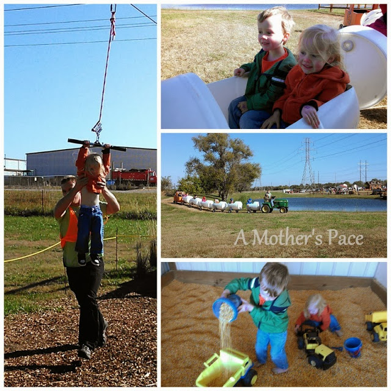
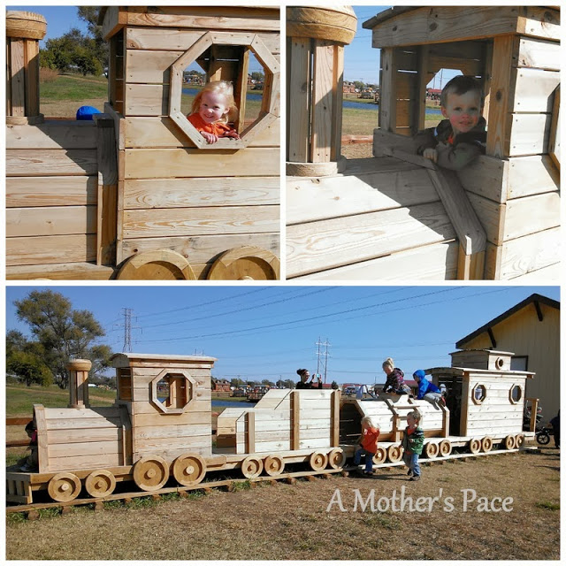
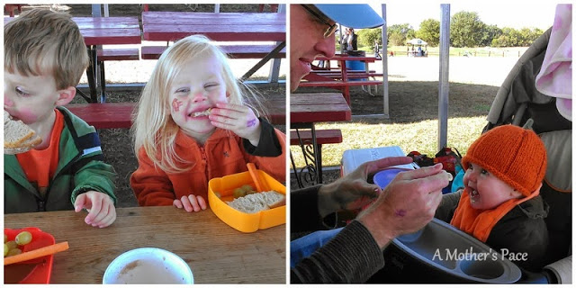

This week ended up being a bit of a running hiatus. After my **[half marathon](http://amotherspace.blogspot.com/2013/10/prairie-fire-half-marathon-race-recap.html#.UmBTtlBQEYk)** on Sunday I fully intended to ease back into running with slow easy runs this week, beginning on Monday with a recovery jog or Tuesday with an easy run.   
  
As it turned out Thursday was my first time out and my right calf didn't like it very much. Right away it felt tight. I thought it would ease up but it kept feeling worse as my run went on.   
  
I turned around and ran home instead of completing my planned 3 miles. In recent history I can't remember a run where I've had to call it quits because of pain. I'm hoping that the cramping and tightness will go away soon. I'm wearing my compression socks and foam rolling to make it happen.  
  
  

<table align="center" cellpadding="0" cellspacing="0"><tbody><tr><td></td></tr><tr><td>Old marathon shoes and compression socks work well together at the pumpkin patch!</td></tr></tbody></table>

  
I might have pushed through the run yesterday but I knew we were going to the pumpkin patch and I would have to be on my feet. I didn't want to aggravate my calf further plus I didn't want to make the pumpkin patch difficult for me or less of an experience for the kids because I was hurting.  
  
  

  
The pumpkin patch was pretty amazing. We always go to Applejack Pumpkin Patch and this year we had a beautiful day. Clear skies with chilly fall air. Just wearing a sweater or light jacket to the pumpkin patch is perfection.   
  
  

  
The kids picked out their favorite pumpkins. Little A (my brave one) rode the zip line and went down the giant slide with me. (She had a blast, even though she looks a little scared!) The kids road on a tractor train and played in some corn.  
  
  

  
One of the highlights was playing on their new wooden train. We decided that Grandpa should build one of these for his backyard. :)  
  
  

  
We also ate lunch before we left. Everyone was hungry and our packed sandwiches, carrots and grapes hit the spot. Little E enjoyed some oatmeal, squash and carrots.  
  
It just doesn't truly seem like fall until we've had a trip to the pumpkin patch!  
  
  
  
  

\------------------------------------------

  

Staying at home with kids sounds easy, right? Life with 3 little ones is busier than I imagined. I don't write every day on the blog but I do update Facebook, Twitter and Instagram more often.   
  
Find A Mother's Pace on...  
  
Twitter [@amotherspace3](https://twitter.com/amotherspace3)  
  
Facebook [amotherspace3](http://facebook.com/amotherspace3)  
  
Instagram [amotherspace](http://instagram.com/amotherspace)  
  
Pinterest [amotherspace](http://pinterest.com/amotherspace/)  
  
Bloglovin' [A Mother's Pace](http://www.bloglovin.com/en/blog/6680087)  
  
RSS [amotherspace](http://feeds.feedburner.com/amotherspace)
