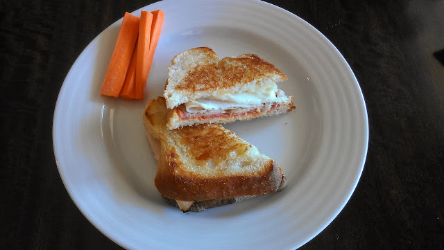

I was flipping through some of my Instagram photos and realized that I've eaten a lot of yummy food lately. I'm sharing some of them with you today so sit back and be prepared to drool a little!

  

We've almost used up all of our **[apples from the orchard](http://amotherspace.blogspot.com/2013/10/apple-picking.html#.UmWBLVBQEYk)**. So far we've eaten them plain, had apple crisp and made applesauce. I have 10 apples left and I intend to make apple crisp again this weekend. It was delicious, here's the **[recipe](http://allrecipes.com/recipe/apple-crisp-ii/)** that I used.

  

My husband made applesauce, which neither of us had ever done before. It turned out so good, I was surprised! 

  

  

Thanks to this handy contraption, the texture was exactly like store bought applesauce. My husband didn't add anything to the apples. We were going to add cinnamon or possibly sugar, if needed, but it was amazing without it. 

  

We have 9 jars ready for the freezer. All 3 of my children love applesauce so we'll eat our way through this quickly.

  

  

I'm not a huge fan of pumpkin pie but I love Pumpkin Chocolate Chip cookies. I made up a (double) batch which made our house smell amazing. These are pretty fantastic with a bowl of vanilla ice cream.

  

Every fall I start to crave warm oatmeal for breakfast. There's just something about going out for a run in the chilly air and coming in to enjoy a warm meal. 

  

  

This week I made a new recipe to use up some of the leftover pumpkin from the cookies. [**Anne's Pumpkin Pie Oatmeal**](http://www.fannetasticfood.com/recipes/pumpkin-pie-oatmeal/) was the perfect match. I wasn't too sure about the blueberries in this recipe but I decided to add them anyway. They were delicious! They only thing I will add next time is a handful of walnuts or granola to the top for a little crunch.

  

And one last non-Instagram photo to share with you. A few days ago we made pizza with capicola ham, deli pepperoni and a few other ingredients. This week my husband (yes, he does A LOT in the kitchen and is a fantastic cook!) made the best sandwiches with the leftovers. 

  
  

  

He piled the capicola ham, pepperoni, some turkey, fresh mozzarella and some monterey jack cheese on locally baked stone hearth bakery bread. Warmed it up on the stove top for a perfectly warm and crunchy sandwich. IT. WAS. AMAZING.  
  
I already want another but we'll have to go to the store first.

  
  

**What are your favorite foods right now? What would you make after visiting an apple orchard?**

  
Today I'm linking up with Jenn over at [Peas and Crayons](http://www.peasandcrayons.com/) for WIAW.  
  

\------------------------------------------

  

Staying at home with kids sounds easy, right? Life with 3 little ones is busier than I imagined. I don't write every day on the blog but I do update Facebook, Twitter and Instagram more often.   
  
Find A Mother's Pace on...  
  
Twitter [@amotherspace3](https://twitter.com/amotherspace3)  
  
Facebook [amotherspace3](http://facebook.com/amotherspace3)  
  
Instagram [amotherspace](http://instagram.com/amotherspace)  
  
Pinterest [amotherspace](http://pinterest.com/amotherspace/)  
  
Bloglovin' [A Mother's Pace](http://www.bloglovin.com/en/blog/6680087)  
  
RSS [amotherspace](http://feeds.feedburner.com/amotherspace)
