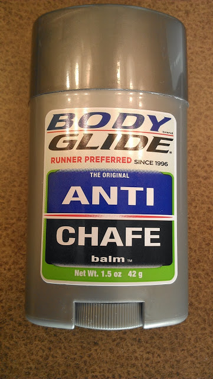
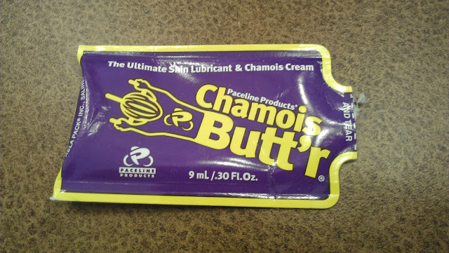

I'm not new to running. I've been doing it fairly regularly since middle school. (That was quite a while ago!) I don't consider myself an 'expert' and I'm not the fastest runner out there but I do know a thing or two about running.   
  
Here's the thing. Something about this past training cycle made me chafe like CRAZY!   
  
Any runner will agree that chafing is no fun at all. That moment when you get in the shower and all the salt runs down over the spots that chafed. Many of them a surprise until the pain strikes. Ouch! That moment is awful. Sometimes I don't even want to shower after running because I know it's going to be bad.   
  
I have even changed clothes (into dry clothes) and then shortened one run on the treadmill because I couldn't take it anymore.  
  
Was it the high humidity of the summer? That's what I thought until it continued to happen when the weather cooled down. Of course, it is better but it still happens.   
  
It's not the mileage I'm running because I've done more than this and haven't chafed this badly before.  
  
I'm guessing that my bras are the problem. I wear [Moving Comfort](http://amzn.to/17cJm7f) and I love them. I think it's time to get fitted again. I was fitted 2 years ago and continued to run in the same bras during a pregnancy and throughout nursing my baby. It's definitely time to get fitted again.  
  
It's too much of an investment to replace all of my bras and hope that it solves the problem. So that's where you come in. I need help with products to help chafing.  
  
  

  
I use [Body Glide](http://amzn.to/1djJP9o) all the time. Until recently it did the job but unfortunately it's not working everywhere anymore.   
  
  

  
I've also used [Chamois Butt'r](http://amzn.to/1djLRGv). It doesn't really work any better than the Body Glide and it leaves a residue on my clothing.   
  
I'm sure there are other products out there. I'm hoping there is the perfect something out there that will solve my problem.   
  
  

**What tips do you have to prevent chafing? What products do you use?**

Updated: I'm linking up this post with [Jill Conyers](http://jillconyers.com/2013/10/michelle-bridges-12-week-body-transformation-the-emotional-toll-of-a-running-injury/) and [Running Bloggers](http://runningbloggers.com/) for Fitness Friday.

\------------------------------------------

  

Staying at home with kids sounds easy, right? Life with 3 little ones is busier than I imagined. I don't write every day on the blog but I do update Facebook, Twitter and Instagram more often.   
  
Find A Mother's Pace on...  
  
Twitter [@amotherspace3](https://twitter.com/amotherspace3)  
  
Facebook [amotherspace3](http://facebook.com/amotherspace3)  
  
Instagram [amotherspace](http://instagram.com/amotherspace)  
  
Pinterest [amotherspace](http://pinterest.com/amotherspace/)  
  
Bloglovin' [A Mother's Pace](http://www.bloglovin.com/en/blog/6680087)  
  
RSS [amotherspace](http://feeds.feedburner.com/amotherspace)
