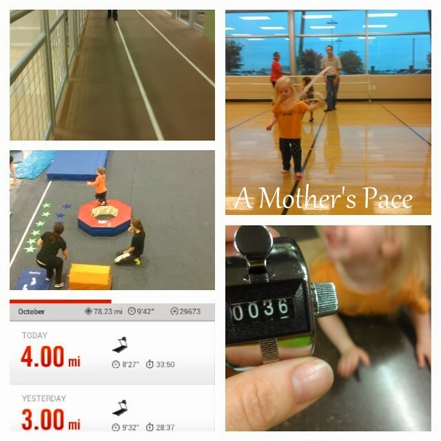
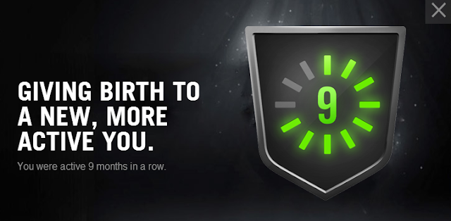
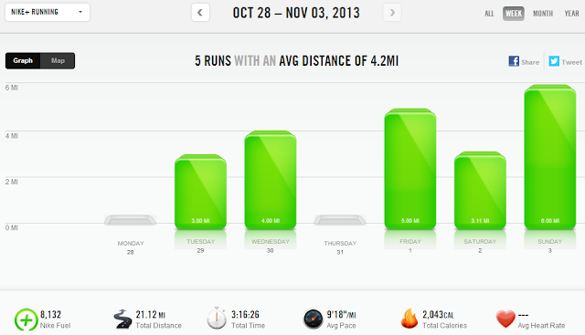

Strangely, this week most of my running was done in the evening. I switched around some of my running days to make my schedule work but I still was able to fit in 5 days.  
  
One way that I fit in an unexpected workout was to run while my son had his gymnastics class. I ran around the track and watched his class from above.   
  
  

  
My Y workout was supposed to be a tempo and for some reason it is very easy to run faster on the track. Those miles flew by. I kept track of the laps with my lap counter and had my Nike+ app recording the workout too.  
  
We like to make an evening of our Y visit. Little A has her dance class, then they get to climb on the rock wall and we end with gymnastics.  
  
This week I also earned a fun Nike+ badge. At least it made me smile.  
  

  
Although I'm not exactly sure how they get 9 months. Little E just turned 8 months old and I took a few weeks off to recovery from delivery after she was born. Hmmm...  
  
  
  

  
**Weekly Workouts**  
  
Monday: Rest  
  
Tuesday: 3 miles (9:32 pace)  
  
Wednesday: 4 tempo miles (8:28 pace)  
  
Thursday: Rest  
  
Friday: 5 miles: Fall 5 and 10 Virtual Race Series (8:57 pace) + 60 sec. plank  
  
Saturday: 3.11 easy miles (9:48 pace) + 60 sec. plank  
  
Sunday: 6 miles (9:46 pace) + 90 sec. plank  
  
  

  
  
Total Running Miles: 21.11  
Weekly Average Pace: 9:18  
  
November Running Miles: 14.11  
2013 Running Miles: 470.23  
  
  
  

**Do you workout at a gym? Do you prefer the track or a treadmill?**

  
  

\-------------------------------

  

Find A Mother's Pace on...  
  
Twitter [@amotherspace3](https://twitter.com/amotherspace3)  
  
Facebook [amotherspace3](http://facebook.com/amotherspace3)  
  
Instagram [amotherspace](http://instagram.com/amotherspace)  
  
Pinterest [amotherspace](http://pinterest.com/amotherspace/)  
  
Bloglovin' [A Mother's Pace](http://www.bloglovin.com/en/blog/6680087)  
  
RSS [amotherspace](http://feeds.feedburner.com/amotherspace)
