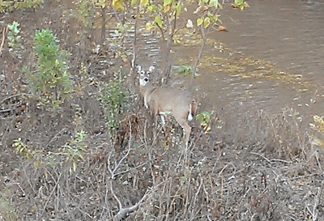
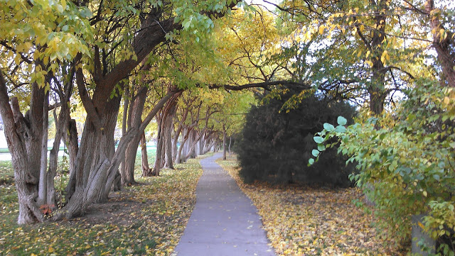
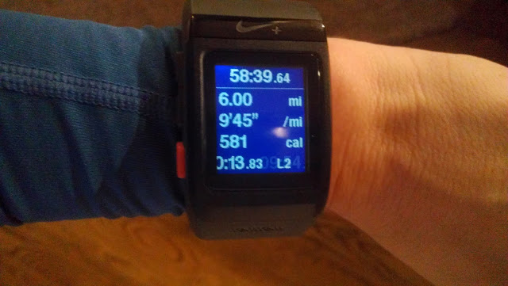
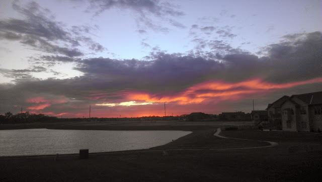

To say that my run on Sunday was interesting would be to put it mildly.   
  
It was another evening run for me but different this time around because of the time change. I left the house around 4:20 thinking that I would have plenty of time to finish before sunset. Maybe that would have been the case if so many crazy things didn't happen during this run.  
  

First, as I was running over a bridge I noticed this deer hanging out by the creek.  
  
It's happened [before](http://amotherspace.blogspot.com/2012_05_01_archive.html#.Unf7ovlQEYl) but I'll never get tired of seeing them. Unfortunately, I must have scared this one a little and he started running away and then turned around right into the traffic. Luckily, he stopped and turned around only to try again a couple of seconds later. He made it across the street safely and I'm so glad.   
  
I finally continued on with my run only to stop about a mile later as a dog ran across the street at me. At first she scared me (I HATE loose dogs while running. But I am very much a dog person overall.) and I just told her to SIT and STAY while I kept running. Then I realized she ran across a busy street to get to me and I'd better stop and try and find her owners. I almost killed a deer earlier in my run, I sure didn't want to be responsible for this little doggy!  
  
I got a hold of them and played with her while waiting for them to come and pick her up. Kyla was her name and I so wish I'd snapped a picture of her. She is a good girl!   
  
I finally continue on with my run and I'm noticing how dark it is getting. My plan was just a simple out and back on this lovely street.  
  

  

 But I decided to head back to my neighborhood a little early so that I could avoid running on a certain narrow street with no shoulder in the dark. Safety first, people! :)  
  
The narrow road was a bit too busy for my taste and so I decided to walk a bunch of it off in the ditch so that I could distance myself from the cars. As I was walking I looked over to my left and saw a beaver hunched down in the grass just watching me. That is definitely a first!   
  
I ran a little extra once I got to my neighborhood but the wind had really picked up and I didn't feel like battling the Kansas wind at this point. It was also getting close (or really past) dinner time so I needed to cut it short (just a mile) and head home.  
  

  
  
All in all, between the deer, the dog and the walking to avoid a busy street I ended up extending my workout for 20 minutes. My Charity Miles app was tracking my workout and I don't pause that one like I pause my GPS watch when I stop.  
  
Yes, this one will go down in the books as one of the craziest runs I've experienced! It ended on a beautiful note though with a gorgeous sunset.  
  

  
  

**What wildlife do you see while on the run? Have you ever rescued a lost dog while running?**

  

  

\------------------------------------------

  
Find A Mother's Pace on...  
  
Twitter [@amotherspace3](https://twitter.com/amotherspace3)  
  
Facebook [amotherspace3](http://facebook.com/amotherspace3)  
  
Instagram [amotherspace](http://instagram.com/amotherspace)  
  
Pinterest [amotherspace](http://pinterest.com/amotherspace/)  
  
Bloglovin' [A Mother's Pace](http://www.bloglovin.com/en/blog/6680087)  
  
RSS [amotherspace](http://feeds.feedburner.com/amotherspace)
