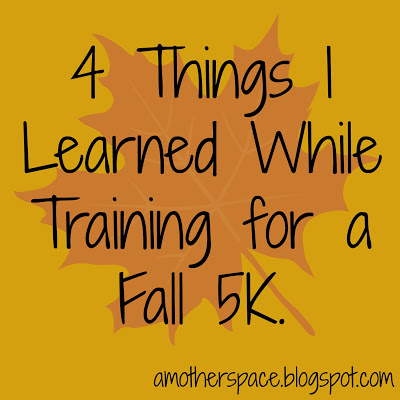
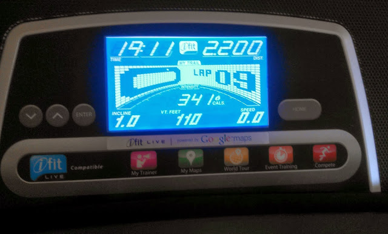
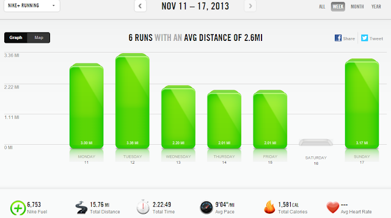

Yesterday was the Girls on the Run 5K. Recap coming tomorrow!  
  

  
  
Last week marked the end of my training plan for the 5K. It's the first time that I've followed a plan before a 5K. Technically, I didn't follow the entire plan because I jumped into the middle of it after running my half marathon in October.   
  
What plan did I follow? I went with the classic Hal Higdon **[Intermediate Training Program](http://halhigdon.com/training/50934/5K-Intermediate-Training-Program)**.  
  
  

  
  
\[1\]  
I took it a little easier on myself than a normal training plan. Once, I was supposed to run a 7 mile long run but I couldn't get it in over the weekend and I didn't sweat it. I just ran the 4 miles that I was able to get in and called it good. I've never missed a long run during a half or full training cycle.  
  
\[2\]  
I like following training plans because it motivates me to run. If I have a set distance and pace to run for the day it is much easier for me to actually accomplish it. I discovered that this is true even for a 5K training plan.  
  
\[3\]  
I didn't really take my 'taper' week seriously last week. Just running short 2 milers made me want to run faster. I'm ready to run faster.  
  
  

  
  
\[4\]  
I really like speed work. Whether it's 400 repeats or a tempo run, it is the run that I look forward to all week.  
  
  
  
  

  
**Weekly Workouts**  
  
Monday: 3 easy treadmill miles (9:35 pace)   
  
Tuesday: 3.35 tempo treadmill miles (8:56 pace)  
  
Wednesday: 2.20 treadmill miles (8:38 pace)  
  
Thursday: 2.01 treadmill miles (8:56 pace)  
  
Friday: 2.01 easy miles (9:41 pace)  
  
Saturday: Rest Day  
  
Sunday: Girls on the Run 5K: 3.17 race miles (8:35 pace)  
  
  

  
  
Total Running Miles: 15.73  
Weekly Average Pace: 9:04  
  
November Running Miles: 44.94  
2013 Running Miles: 479.95  
  
  
  

**Have you followed a 5K training plan before? What did you learn during training?**

  
  

\-------------------------------

  

Find A Mother's Pace on...  
  
Twitter [@amotherspace3](https://twitter.com/amotherspace3)  
  
Facebook [amotherspace3](http://facebook.com/amotherspace3)  
  
Instagram [amotherspace](http://instagram.com/amotherspace)  
  
Pinterest [amotherspace](http://pinterest.com/amotherspace/)  
  
Bloglovin' [A Mother's Pace](http://www.bloglovin.com/en/blog/6680087)  
  
RSS [amotherspace](http://feeds.feedburner.com/amotherspace)
