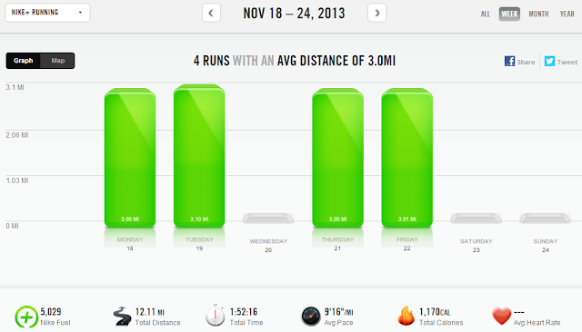

  
Today my little girl turns 3 years old.  
  
We celebrated over the weekend with our family and friends.   
  
She had a Dora themed party with a Dora cake. Little A helped with the flowers on her dress.  
  
We're celebrating more today with some homemade pizza and cupcakes tonight for dinner and dessert. 3 years old! Where does the time go?  
  
Last week was a good week for running. I don't have a specific race on the calendar so I'm just taking it easy during my 'off season.' My busy weekend of birthday festivities led to a run-free weekend.  
  

  
It's starting to get really cold here. One of my runs from the week was a windchill of 12 degrees. Brrr!! I do have the treadmill to fall back on but I still like to get out and run even if it is super cold out.  

  

  

  
**Weekly Workouts**  
  
Monday: 3 treadmill miles (9:20 pace)  
  
Tuesday: 3.1 miles (9:12 pace)  
  
Wednesday: Rest Day  
  
Thursday: 3 miles (9:18 pace)  
  
Friday: 3.01 miles (9:00 pace)  
  
Saturday: Rest Day  
  
Sunday: Rest Day  
  
  
  

  
  
Total Running Miles: 12.11  
Weekly Average Pace: 9:16  
  
November Running Miles: 57:05  
2013 Running Miles: 492.06  
  
  
  

**How do you run during your off season? Do you run outside during the freezing cold?**

  
  

\-------------------------------

  

Find A Mother's Pace on...  
  
Twitter [@amotherspace3](https://twitter.com/amotherspace3)  
  
Facebook [amotherspace3](http://facebook.com/amotherspace3)  
  
Instagram [amotherspace](http://instagram.com/amotherspace)  
  
Pinterest [amotherspace](http://pinterest.com/amotherspace/)  
  
Bloglovin' [A Mother's Pace](http://www.bloglovin.com/en/blog/6680087)  
  
RSS [amotherspace](http://feeds.feedburner.com/amotherspace)
