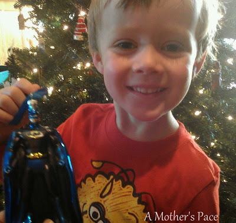

[ | A Mother's Pace")](http://amotherspace.net/wp-content/uploads/2013/12/Angel1.jpg)

We've put our Christmas tree up over the past couple of days. It's a tradition that (if we are in town) we try and put the tree up the day after Thanksgiving.  
  
It's Little E's first Christmas and so far she's a fan. She is in LOVE with the angel that we have on the top of our tree. In fact, it's the first thing that she's ever pointed too. All she wants is to be lifted up close to the angel. So cute.   
  
Little A was given the job of putting the angel on the tree. And both of the big kids helped to put ornaments on the tree. My sister was in town to help us out too.  
  

[ | A Mother's Pace")](http://amotherspace.net/wp-content/uploads/2013/12/Tree1.jpg)

  
It seems I'm jumping ahead a little by talking about Christmas. Here's a quick look back at November.  
  
**Mothering Moments**  
  
My Little A turned 3 in November. She's loving babies, trains, owls and Dora right now. She's such a silly little girl and makes us laugh all the time.  
  

[ | A Mother's Pace")](http://amotherspace.net/wp-content/uploads/2013/12/3+years+old%2521+Celebrating+with+Dora.+%2523birthdaygirl1.jpg)

  
Little O has been almost as excited about all the birthday presents in the house as his sister. He's also particularly happy with his new ornament this year. He's totally in to 'scary men.'   
  

  
Little E has so much going on. She's 9 months old, crawling all over the place, pulling up on furniture, and eating a lot of new food. She tried turkey for the first time on Thanksgiving.  
  

[ | A Mother's Pace")](http://amotherspace.net/wp-content/uploads/2013/12/E+Turkey1.jpg)

  
**Racing/Training in November**  
  
[**Fall 5 and 10 Virtual Race Series**](http://amotherspace.blogspot.com/2013/11/fall-5-and-10-virtual-race-series.html#.UppD0sRQEYk)  

We have one more race to go in the series. My November 5 and 10 recap was one of my most popular posts this month. I've enjoyed participating each month and look forward to running the last in the series this week.  
  

[**Girls on the Run 5K Race Recap**](http://amotherspace.blogspot.com/2013/11/girls-on-run-5k-race-recap.html#.UppDucRQEYk)  
This GOTR 5K is one of my favorite races of the year. It's inspiring to see all the young girls run their race that they have trained so hard for months to complete.   
  

[ | A Mother's Pace")](http://1.bp.blogspot.com/-PYILP6re08k/UoqUUqyXnpI/AAAAAAAAS7Y/4w71dJnIS8s/s1600/A+windy+Kansas+day+made+this+5k+tough+but+I+had+fun%2521+I+even+managed+to+snag+a+2nd+place+age+group+finish%2521+%2523sweatpink+%2523motherrunner+%2523GOTR+%2523nikeplus+%2523nikeplususers+%2523sparklysoul.JPG)

  
**Challenges**

The Runner's World Winter Run Streak started the day after Thanksgiving. As soon as I finished the [**summer run streak**](http://amotherspace.blogspot.com/2013/07/what-i-learned-from-streaking.html#.UppGg8RQEYk) I knew that I wanted to participate in the winter one as well. I've signed on to run at least a mile every day between Thanksgiving and New Years Day. Follow along with all the streakers on Twitter and Instagram using the hashtag #RWRunStreak.  
  
**A Few of my Favorites from A Mother's Pace**  
  
[**He's Back and You Can Save a Life**](http://amotherspace.blogspot.com/2013/11/hes-back-running-and-you-can-save-life.html#.UppDw8RQEYk)

I've brought back my Friday Five in November. A random post sharing various thoughts is fun to put together once a week. 

  
[**A Deer a Dog and a Beaver?**](http://amotherspace.blogspot.com/2013/11/a-deer-dog-and-beaver.html#.UppDz8RQEYk)

A post about my most interesting run of the month, by far!  
  

[ | A Mother's Pace")](http://amotherspace.net/wp-content/uploads/2013/12/IMAG31391.jpg)

  

  

[**Family Night at the Y**](http://amotherspace.blogspot.com/2013/11/family-night-at-y.html#.UppD2MRQEYk)  
With the kids enrolled in dance and gymnastics we spend a lot of time at the Y. Sometimes I actually get a workout in as well.  
  
**Favorite Running Gear**The Leukemia and Lymphoma Society (LLS) is a charity that is close to my heart. My family is very active in raising money for LLS and one of the easiest ways I've found to do it lately is with the [**Charity Miles App**](http://www.charitymiles.org/). It couldn't be easier. Just load the app on your phone, start the app before going for a run, choose your charity (LLS!!) and share your run on facebook or Twitter. Easy money for an important charity that helps families and saves lives.   
  

[ | A Mother's Pace")](http://amotherspace.net/wp-content/uploads/2013/12/3+easy+evening+miles+for+%2523llsusa+with+%2523charitymiles.+%2523everymilematters1.jpg)

  
  
**Workouts in July**  
  

[ | A Mother's Pace")](http://1.bp.blogspot.com/-m0uhDSnfhH4/UppJgQAW5CI/AAAAAAAATqI/_fv9hf-Ub78/s1600/NikeNovember.PNG)

  
  
Total November Running Miles: 72.05  
Treadmill Miles: 20.57  
  
Average Pace: 9:27  
  
Total Running Miles for 2013: 507.06  
  
  
  

**Have you put a Christmas tree up yet?**

  
  

\------------------------------------------

  
Find A Mother's Pace on...  
  
Twitter [@amotherspace3](https://twitter.com/amotherspace3)  
  
Facebook [amotherspace3](http://facebook.com/amotherspace3)  
  
Instagram [amotherspace](http://instagram.com/amotherspace)  
  
Pinterest [amotherspace](http://pinterest.com/amotherspace/)  
  
Bloglovin' [A Mother's Pace](http://www.bloglovin.com/en/blog/6680087)  
  
RSS [amotherspace](http://feeds.feedburner.com/amotherspace)
